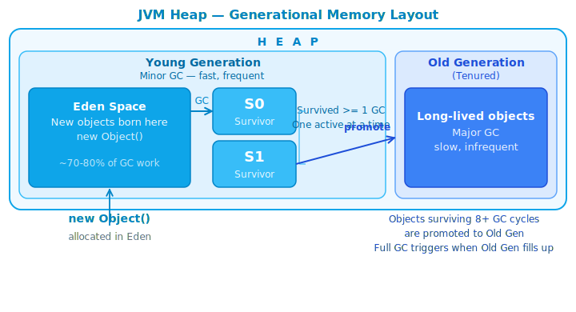

# JVM — How It Actually Works

## 1. What is it

The Java Virtual Machine (JVM) is an abstract computing machine that executes Java bytecode.
It sits between your compiled `.class` files and the underlying operating system,
providing a uniform execution environment regardless of hardware or OS.

The execution pipeline has three stages:

```
MyApp.java  →  [javac]  →  MyApp.class  →  [JVM]  →  Running program
 Source code               Bytecode          Executes on any OS
```

!!! note "Write once, run anywhere"
    Your `.class` bytecode is identical on Windows, macOS, and Linux.
    The JVM for each OS is different — but your code is not.
    This is the fundamental promise of Java.

---

## 2. Why it matters

Understanding the JVM is not academic. It explains:

- Why `==` behaves differently on primitives vs objects
- Why some code causes `OutOfMemoryError` and how to fix it
- Why your application slows down unpredictably (GC pauses)
- Why Java is "slow at startup" but fast afterwards
- How to tune performance without guessing

Every bug involving memory, threading, or performance traces back to how the JVM manages
execution. A developer who understands this section debugs 10× faster than one who doesn't.

---

## 3. How it works

The JVM has five core subsystems. Each has a specific, non-overlapping responsibility.


### 3.1 ClassLoader Subsystem

Before any code runs, `.class` files must be loaded into memory.
The ClassLoader does this in three phases:

| Phase | What happens |
| --- | --- |
| **Loading** | Reads `.class` file bytes from disk (or JAR, or network) |
| **Linking** | Verifies bytecode is valid, allocates memory for static fields, resolves symbolic references |
| **Initialization** | Runs static initializers, assigns static field values |

There are three built-in ClassLoaders, forming a delegation chain:

```
Bootstrap ClassLoader   ← loads java.lang, java.util (from JDK itself)
    ↑ delegates to
Platform ClassLoader    ← loads javax.*, java.sql (from JDK modules)
    ↑ delegates to
Application ClassLoader ← loads YOUR code (from classpath)
```

!!! tip "Parent delegation model"
    When you load a class, the ClassLoader always asks its parent first.
    Only if the parent cannot find the class does the child attempt to load it.
    This prevents malicious code from replacing core classes like `java.lang.String`.

---

### 3.2 Runtime Memory Areas

This is where most production bugs live. The JVM divides memory into distinct areas.

#### Heap

The largest memory area. **Shared across all threads.** All objects and arrays live here.

```
Heap
├── Young Generation
│   ├── Eden Space          ← new objects born here
│   ├── Survivor Space S0   ← objects that survived 1st GC
│   └── Survivor Space S1   ← objects that survived 2nd GC
└── Old Generation (Tenured)
    └── long-lived objects promoted from Young Gen
```



!!! tip "Mental model"
    Think of Eden as a nursery. Most objects die young — a loop variable, a temporary DTO.
    Objects that survive multiple garbage collections get "promoted" to Old Gen,
    like residents moving to permanent housing.

The Garbage Collector runs primarily in Young Gen (minor GC, fast) and occasionally
in Old Gen (major/full GC, slow).

!!! info "Java 25 — Compact Object Headers (JEP 519)"
    Every object on the Heap carries a header with metadata (hash code, class pointer, locking info).
    Before Java 25, this header consumed **12–16 bytes** per object.
    Java 25 shrinks it down to **8 bytes** — for applications creating millions of small objects,
    this significantly reduces heap pressure and improves cache locality.
    Enable with: `-XX:+UseCompactObjectHeaders`

#### JVM Stack (per platform thread)

Each platform thread gets its own **private** stack. When a method is called, a **stack frame** is
pushed. When the method returns, the frame is popped.

A stack frame contains:

- Local variables (including method parameters)
- Operand stack (intermediate computation results)
- Reference to the constant pool

```java
void methodA() {
    int x = 10;        // x lives in methodA's stack frame
    methodB(x);        // new frame pushed on top
}                      // frame popped here, x is gone

void methodB(int y) {
    // y is a copy of x — primitives are passed by value
}
```

!!! warning "StackOverflowError"
    Infinite recursion without a base case keeps pushing frames until
    the stack has no more space. This is what `StackOverflowError` means —
    not a Heap memory issue.

#### Virtual Thread Stack (Java 21+)

**Virtual threads** (JEP 444, finalized Java 21) fundamentally change the memory model for concurrency.

Unlike platform threads with a fixed JVM Stack, a virtual thread stores its stack as
**`StackChunk` objects on the Heap** — lightweight (a few KB) and able to grow/shrink dynamically.

```
Platform Thread                    Virtual Thread (Java 21+)
├── OS Thread (1:1)                ├── Carrier Thread (small shared pool)
└── Fixed JVM Stack (~512KB)       └── StackChunk[] on Heap (few KB, dynamic)
```

The JVM can manage **millions** of virtual threads with a small pool of carrier threads —
not limited by the OS thread limit.

!!! tip "For backend developers"
    Spring Boot 3.2+ supports virtual threads automatically. Enable with:
    `spring.threads.virtual.enabled=true`
    Each HTTP request gets its own virtual thread without risking resource exhaustion.

#### Method Area (Metaspace in Java 8+)

Shared across all threads. Stores:

- Class-level metadata (class name, superclass, interfaces)
- Static fields and their values
- Method bytecode
- Constant pool (string literals, numeric constants)

!!! note "PermGen → Metaspace"
    Before Java 8, this was called **PermGen** and had a fixed size —
    the infamous `OutOfMemoryError: PermGen space`. Java 8 replaced it with
    **Metaspace**, which grows dynamically using native memory.

#### PC Register & Native Method Stack

Each thread has its own **PC Register** holding the address of the instruction currently
being executed. The **Native Method Stack** supports C/C++ methods called via JNI —
you rarely interact with this directly.

---

### 3.3 Execution Engine

The engine reads bytecode and executes it. It has three components working together.

#### Interpreter

Reads and executes bytecode instructions one at a time. Simple to start, but slow for
repeated code — it re-interprets the same instruction every time it runs.

#### JIT Compiler (Just-In-Time)

The JVM tracks which methods are called frequently (called **hotspots**). When a method
crosses an invocation threshold, the JIT compiles it to native machine code and caches it.
Subsequent calls skip interpretation entirely.

```
First 1000 calls:    Interpreter runs bytecode    (slow, flexible)
After 1000 calls:    JIT compiles to native code  (fast, optimized)
Call 1001 onwards:   Native code runs directly    (near C++ speed)
```

!!! tip "Why Java is 'slow at startup'"
    Java programs are slower on startup because the JIT hasn't compiled anything yet.
    After warmup, they reach peak performance. This is why benchmarks must always
    account for warmup time — measuring cold-start performance is misleading.

#### AOT — Ahead-of-Time Compilation (Java 25+)

Java 25 introduces **AOT Class Loading & Linking** (Project Leyden): the JVM records class and
profile data from a previous run into a cache file. On subsequent startups, it loads the
cache — the application starts nearly pre-warmed.

```
Run 1 (training):     JVM profiles → writes cache to disk
Run 2+ (production):  Loads cache → skips warmup → near peak performance immediately
```

This is Java's answer to the slow startup problem — the historical reason why serverless
and containers favored Go or GraalVM native images over the JVM.

#### Garbage Collector

Automatically reclaims memory from objects no longer reachable by any live thread.
The GC uses **reachability** as its criterion.

```java
String s = new String("hello"); // object created on Heap
s = null;                        // reference dropped
// The String is now unreachable — eligible for GC
// GC will reclaim it at the next collection cycle
```

| GC | Notes | When to use |
| --- | --- | --- |
| **G1GC** | Default since Java 9 | Balanced latency/throughput — fits most applications |
| **ZGC** (Generational) | Experimental Java 11, stable Java 15, Generational from Java 21 | Sub-ms pauses, latency-critical systems |
| **Shenandoah** (Generational) | OpenJDK Java 12, Generational production in Java 25 (JEP 521) | Sub-ms pauses, throughput-focused |

!!! note "Common misconception — GC history"
    ZGC was introduced in **Java 11** (experimental), stable from Java 15.
    Shenandoah was introduced in **Java 12** (OpenJDK), stable from Java 15.
    Java 21 introduced **Generational ZGC** — adding Young/Old tiers to ZGC, not ZGC itself.
    **Java 25 LTS** is the current baseline. G1GC remains the default.

---

## 4. Code example

This code demonstrates what lives on the Stack vs the Heap:

```java title="JvmMemoryDemo.java" linenums="1"
public class JvmMemoryDemo {

    // Static field — lives in Method Area (Metaspace)
    private static final String APP_NAME = "JvmDemo";

    public static void main(String[] args) {
        // Primitives — live in the Stack frame of main()
        int count = 5;
        double price = 9.99;

        // Reference on Stack, actual object on Heap
        String label = new String("item");

        // New Stack frame created for calculate()
        int result = calculate(count, price);

        System.out.println(result);
    } // main() frame popped. label reference gone.
      // The String "item" on Heap is now eligible for GC.

    private static int calculate(int qty, double unitPrice) {
        // qty and unitPrice are copies (pass by value)
        // This frame sits on top of main()'s frame in the Stack
        double total = qty * unitPrice;
        return (int) total;
    } // frame popped
}
```

To observe GC activity at runtime:

```bash
java -Xms256m -Xmx512m \
     -XX:+PrintGCDetails \
     -XX:+PrintGCDateStamps \
     -jar your-app.jar
```

| JVM Flag | Meaning |
| --- | --- |
| `-Xms256m` | Initial heap size: 256 MB |
| `-Xmx512m` | Maximum heap size: 512 MB |
| `-Xss512k` | Stack size per platform thread: 512 KB |
| `-XX:+UseZGC` | Use Generational ZGC (Java 25 LTS) |
| `-XX:+UseCompactObjectHeaders` | Compact object headers — Java 25 |

---

## 5. Common mistakes

### Mistake 1 — Confusing Stack and Heap

```java
// WRONG mental model: "objects live on the Stack"
Person p = new Person("Alice");

// CORRECT:
// p (the reference variable) → Stack frame of current method
// new Person("Alice") (the actual object) → Heap
//
// When the method returns, p is gone,
// but the Person object stays on the Heap
// until no references point to it.
```

### Mistake 2 — Assuming GC runs immediately

```java
String s = new String("heavy object");
s = null;
System.gc(); // This is a HINT to the JVM, not a command.
             // The object may NOT be collected right now.
             // Never design code that depends on GC timing.
```

### Mistake 3 — String concatenation in loops

```java
// BAD — creates a new String object on Heap every iteration
String result = "";
for (int i = 0; i < 10_000; i++) {
    result += i;
}

// GOOD — StringBuilder reuses an internal char buffer
StringBuilder sb = new StringBuilder();
for (int i = 0; i < 10_000; i++) {
    sb.append(i);
}
String result = sb.toString();
```

### Mistake 4 — Recursion without a base case

```java
// This throws StackOverflowError — infinite frames
public int factorial(int n) {
    return n * factorial(n - 1);
}

// Fixed
public int factorial(int n) {
    if (n <= 1) return 1;
    return n * factorial(n - 1);
}
```

---

## 6. Interview questions

**Q1: What is the difference between Stack and Heap in Java?**

> Stack is per-thread, stores local variables and method frames, managed automatically via
> LIFO. Heap is shared across all threads, stores all objects and arrays, managed by the GC.
> Stack overflow → `StackOverflowError`. Heap overflow → `OutOfMemoryError`.

**Q2: What happens when you write `String s = new String("hello")`?**

> Two objects may be created: one in the String Pool (the literal `"hello"`, if not already
> pooled), and one on the regular Heap (the `new String(...)` object). The reference `s`
> lives in the Stack frame. Always prefer `String s = "hello"` — it reuses the pooled instance.

**Q3: What is JIT compilation and why does it matter?**

> JIT detects frequently-called methods ("hotspots") and compiles them to native machine code
> at runtime. This eliminates re-interpretation overhead for hot code paths, bringing Java
> performance close to natively compiled languages. It explains the warmup phenomenon.

**Q4: What is the parent delegation model in ClassLoading?**

> When a ClassLoader is asked to load a class, it first delegates to its parent.
> Only if the parent cannot find the class does the child attempt to load it.
> This guarantees that `java.lang.String` always comes from the Bootstrap ClassLoader —
> user code cannot substitute a malicious replacement.

**Q5: What changed between PermGen and Metaspace?**

> Before Java 8, class metadata lived in PermGen — a fixed-size region inside the JVM heap.
> It frequently caused `OutOfMemoryError: PermGen space` in apps loading many classes.
> Java 8 replaced it with Metaspace, which lives in native OS memory and grows dynamically.

**Q6: How does a Virtual Thread differ from a Platform Thread in JVM memory?**

> A platform thread maps 1:1 to an OS thread and has a fixed JVM Stack (~512KB by default).
> A virtual thread (Java 21+) stores its stack as `StackChunk` objects on the **Heap** — a few KB,
> growing and shrinking dynamically. This allows the JVM to manage millions of virtual threads
> with a small pool of carrier threads, unconstrained by OS thread limits.

---

## 7. Further reading

| Resource | What to read |
| --- | --- |
| [JVM Specification — oracle.com](https://docs.oracle.com/javase/specs/) | Chapter 2: The Structure of the JVM |
| [Inside Java — inside.java](https://inside.java) | GC, JIT, Virtual Threads, Project Leyden |
| [JEP 444 — Virtual Threads](https://openjdk.org/jeps/444) | Virtual thread implementation details |
| [JEP 519 — Compact Object Headers](https://openjdk.org/jeps/519) | Java 25 header memory reduction |
| [JEP 521 — Generational Shenandoah](https://openjdk.org/jeps/521) | Java 25 GC improvement |
| *Effective Java* — Joshua Bloch | Item 6: Avoid creating unnecessary objects |
| *Java Performance* — Scott Oaks | Chapter 3: JIT Compiler · Chapter 5: GC |
| [OpenJDK source](https://openjdk.org) | `hotspot/src` — the JVM implemented in C++ |
