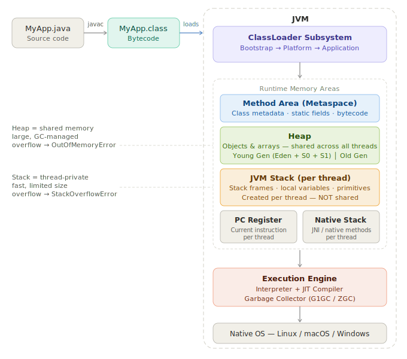

# JVM — Hoạt động thế nào

## 1. Định nghĩa

JVM (Java Virtual Machine) là một máy tính ảo thực thi Java bytecode. Nó nằm giữa file `.class` đã được biên dịch và hệ điều hành bên dưới, cung cấp môi trường thực thi thống nhất bất kể phần cứng hay OS là gì.

Pipeline thực thi gồm ba giai đoạn:

```
MyApp.java  →  [javac]  →  MyApp.class  →  [JVM]  →  Chương trình chạy
 Source code               Bytecode          Chạy được trên mọi OS
```

!!! note "Write once, run anywhere"
    File `.class` bytecode của mày hoàn toàn giống nhau trên Windows, macOS và Linux.
    JVM trên mỗi OS là khác nhau — nhưng code của mày thì không.
    Đây là lời hứa cốt lõi của Java.

---

## 2. Tại sao quan trọng

Hiểu JVM không phải lý thuyết suông. Nó giải thích:

- Tại sao `==` hoạt động khác nhau với primitive và object
- Tại sao code gây ra `OutOfMemoryError` và cách fix
- Tại sao ứng dụng đột nhiên chậm (GC pauses)
- Tại sao Java "chậm lúc mới khởi động" nhưng nhanh sau đó
- Cách tune performance mà không phải đoán mò

Mỗi bug liên quan đến memory, threading, hoặc performance đều có thể truy ngược về cách JVM quản lý execution. Dev hiểu phần này debug nhanh hơn gấp 10 lần so với người không hiểu.

---

## 3. Cách hoạt động

JVM có 5 subsystem cốt lõi. Mỗi cái có trách nhiệm riêng biệt, không chồng chéo nhau.



### 3.1 ClassLoader Subsystem

Trước khi code chạy, file `.class` phải được load vào memory. ClassLoader làm việc này qua 3 giai đoạn:

| Giai đoạn          | Việc gì xảy ra                                                                         |
| ------------------ | -------------------------------------------------------------------------------------- |
| **Loading**        | Đọc bytes của file `.class` từ disk (hoặc JAR, hoặc network)                           |
| **Linking**        | Verify bytecode hợp lệ, cấp phát memory cho static fields, resolve symbolic references |
| **Initialization** | Chạy static initializers, gán giá trị cho static fields                                |

Có 3 ClassLoader tích hợp sẵn, tạo thành chuỗi delegation:

```
Bootstrap ClassLoader   ← load java.lang, java.util (từ JDK)
    ↑ delegate lên
Platform ClassLoader    ← load javax.*, java.sql (từ JDK modules)
    ↑ delegate lên
Application ClassLoader ← load CODE CỦA MÀY (từ classpath)
```

!!! tip "Parent delegation model"
    Khi load một class, ClassLoader luôn hỏi parent trước.
    Chỉ khi parent không tìm thấy thì child mới tự load.
    Điều này ngăn code độc hại thay thế các class cốt lõi như `java.lang.String`.

---

### 3.2 Runtime Memory Areas

Đây là nơi phần lớn production bugs xảy ra. JVM chia memory thành các vùng riêng biệt.

#### Heap

Vùng memory lớn nhất. **Dùng chung cho tất cả các thread.** Tất cả object và array đều sống ở đây.

```
Heap
├── Young Generation
│   ├── Eden Space          ← object mới sinh ra ở đây
│   ├── Survivor Space S0   ← object sống sót qua GC lần 1
│   └── Survivor Space S1   ← object sống sót qua GC lần 2
└── Old Generation (Tenured)
    └── object sống lâu được promote từ Young Gen
```

!!! tip "Mental model"
    Hãy hình dung Eden như một nhà trẻ. Hầu hết object chết trẻ — một biến trong vòng lặp, một DTO tạm thời.
    Object nào sống sót qua nhiều lần GC được "promote" lên Old Gen,
    giống như cư dân chuyển sang nhà ở lâu dài.

GC chạy chủ yếu ở Young Gen (minor GC, nhanh) và thỉnh thoảng ở Old Gen (major/full GC, chậm hơn).

!!! info "Java 25 — Compact Object Headers (JEP 519)"
    Mỗi object trên Heap có một header lưu metadata (hash code, class pointer, locking info).
    Trước Java 25, header này chiếm **12–16 bytes** mỗi object.
    Java 25 thu nhỏ xuống còn **8 bytes** — với ứng dụng tạo hàng triệu object nhỏ,
    điều này giảm rõ rệt heap pressure và cải thiện cache locality.
    Bật bằng: `-XX:+UseCompactObjectHeaders`

#### JVM Stack (mỗi platform thread có riêng)

Mỗi platform thread có stack **riêng tư** của nó. Khi một method được gọi, một **stack frame** được push lên. Khi method return, frame bị pop.

Mỗi stack frame chứa:

- Local variables (bao gồm tham số của method)
- Operand stack (kết quả tính toán trung gian)
- Reference đến constant pool

```java
void methodA() {
    int x = 10;        // x sống trong stack frame của methodA
    methodB(x);        // frame mới được push lên trên
}                      // frame bị pop, x biến mất

void methodB(int y) {
    // y là bản sao của x — primitive được truyền theo giá trị
}
```

!!! warning "StackOverflowError"
    Đệ quy vô tận không có base case sẽ push frame liên tục
    cho đến khi stack không còn chỗ. Đây là ý nghĩa của `StackOverflowError`
    — không phải vấn đề memory trên Heap.

#### Virtual Thread Stack (Java 21+)

**Virtual threads** (JEP 444, finalized Java 21) thay đổi hoàn toàn mô hình memory cho concurrency.

Không giống platform thread có JVM Stack cố định trên OS thread, virtual thread lưu stack của nó dưới dạng **`StackChunk` object trên Heap** — nhỏ gọn (vài KB) và tự grow/shrink theo nhu cầu.

```
Platform Thread                   Virtual Thread (Java 21+)
├── OS Thread (1:1)               ├── Carrier Thread (pool nhỏ, dùng chung)
└── JVM Stack cố định (~512KB)    └── StackChunk[] trên Heap (vài KB, động)
```

JVM có thể quản lý **hàng triệu** virtual threads với pool carrier threads nhỏ — không bị giới hạn bởi OS thread limit.

!!! tip "Với backend developer"
    Spring Boot 3.2+ hỗ trợ virtual threads. Bật bằng:
    `spring.threads.virtual.enabled=true`
    Mỗi HTTP request sẽ có virtual thread riêng mà không lo resource exhaustion.

#### Method Area (Metaspace từ Java 8+)

Dùng chung cho tất cả thread. Lưu trữ:

- Class-level metadata (tên class, superclass, interfaces)
- Static fields và giá trị của chúng
- Bytecode của các method
- Constant pool (string literals, numeric constants)

!!! note "PermGen → Metaspace"
    Trước Java 8, vùng này gọi là **PermGen** với kích thước cố định —
    lỗi kinh điển `OutOfMemoryError: PermGen space`. Java 8 thay bằng
    **Metaspace**, tự động mở rộng dùng native memory của OS.

#### PC Register & Native Method Stack

Mỗi thread có **PC Register** riêng lưu địa chỉ lệnh JVM đang thực thi.
**Native Method Stack** hỗ trợ các method C/C++ được gọi qua JNI — mày hiếm khi tương tác trực tiếp với cái này.

---

### 3.3 Execution Engine

Engine đọc bytecode và thực thi nó. Có ba thành phần hoạt động cùng nhau.

#### Interpreter

Đọc và thực thi từng lệnh bytecode một. Đơn giản, khởi động nhanh, nhưng chậm với code lặp đi lặp lại — nó re-interpret cùng một lệnh mỗi lần chạy.

#### JIT Compiler (Just-In-Time)

JVM theo dõi method nào được gọi thường xuyên (gọi là **hotspots**). Khi một method vượt qua ngưỡng nhất định, JIT compile nó thành native machine code và cache lại. Các lần gọi sau bỏ qua bước interpretation hoàn toàn.

```
1000 lần gọi đầu:    Interpreter chạy bytecode    (chậm, linh hoạt)
Sau 1000 lần:        JIT compile thành native      (nhanh, tối ưu)
Từ lần 1001 trở đi:  Native code chạy trực tiếp   (gần tốc độ C++)
```

!!! tip "Tại sao Java 'chậm lúc mới khởi động'"
    Java chậm lúc startup vì JIT chưa compile gì cả.
    Sau warmup, nó đạt peak performance. Đây là lý do benchmark
    phải tính warmup time — đo cold-start performance là misleading.

#### AOT — Ahead-of-Time Compilation (Java 25+)

Java 25 giới thiệu **AOT Class Loading & Linking** (Project Leyden): JVM ghi lại profile và trạng thái class từ lần chạy trước vào cache. Lần khởi động sau load cache — ứng dụng start gần như đã warm sẵn.

```
Lần chạy 1 (training):    JVM tự profile → lưu cache vào disk
Lần chạy 2+ (production):  Load cache → bỏ qua warmup → gần peak performance ngay
```

Đây là câu trả lời của Java cho vấn đề startup chậm — lý do serverless và container từng ưu tiên Go hay GraalVM native image thay vì JVM.

#### Garbage Collector

Tự động thu hồi memory từ object không còn được tham chiếu bởi bất kỳ live thread nào. GC dùng **reachability** làm tiêu chí.

```java
String s = new String("hello"); // object tạo ra trên Heap
s = null;                        // reference bị bỏ
// String không còn được tham chiếu — eligible for GC
// GC sẽ thu hồi nó ở chu kỳ collection tiếp theo
```

| GC | Ghi chú | Khi nào dùng |
| --- | --- | --- |
| **G1GC** | Mặc định từ Java 9 | Cân bằng latency/throughput, phù hợp đại đa số ứng dụng |
| **ZGC** (Generational) | Experimental Java 11, stable Java 15, Generational từ Java 21 | Pause < 1ms, hệ thống latency-critical |
| **Shenandoah** (Generational) | OpenJDK Java 12, Generational production từ Java 25 (JEP 521) | Pause < 1ms, throughput-focused |

!!! note "Hay bị nhầm — lịch sử GC"
    ZGC ra đời từ **Java 11** (experimental), stable từ Java 15.
    Shenandoah ra đời từ **Java 12** (OpenJDK), stable từ Java 15.
    Java 21 giới thiệu **Generational ZGC** — thêm tầng Young/Old vào ZGC, không phải ZGC lần đầu.
    **Java 25 LTS** là baseline hiện tại. G1GC vẫn là mặc định.

---

## 4. Code ví dụ

Code dưới đây minh họa cái gì sống trên Stack vs Heap:

```java title="JvmMemoryDemo.java" linenums="1"
public class JvmMemoryDemo {

    // Static field — sống trong Method Area (Metaspace)
    private static final String APP_NAME = "JvmDemo";

    public static void main(String[] args) {
        // Primitive — sống trong Stack frame của main()
        int count = 5;
        double price = 9.99;

        // Reference sống trên Stack, object thật sống trên Heap
        String label = new String("item");

        // Gọi method — Stack frame mới được tạo
        int result = calculate(count, price);

        System.out.println(result);
    } // frame của main() bị pop. reference label biến mất.
      // String "item" trên Heap giờ eligible for GC.

    private static int calculate(int qty, double unitPrice) {
        // qty và unitPrice là bản sao (pass by value)
        // Frame này nằm trên frame của main() trong Stack
        double total = qty * unitPrice;
        return (int) total;
    } // frame bị pop
}
```

Xem GC activity khi chạy:

```bash
java -Xms256m -Xmx512m \
     -XX:+PrintGCDetails \
     -XX:+PrintGCDateStamps \
     -jar your-app.jar
```

| JVM Flag | Ý nghĩa |
| --- | --- |
| `-Xms256m` | Heap size ban đầu: 256 MB |
| `-Xmx512m` | Heap size tối đa: 512 MB |
| `-Xss512k` | Stack size mỗi platform thread: 512 KB |
| `-XX:+UseZGC` | Dùng Generational ZGC (Java 25 LTS) |
| `-XX:+UseCompactObjectHeaders` | Compact object headers — Java 25 |

---

## 5. Lỗi thường gặp

### Lỗi 1 — Nhầm lẫn Stack và Heap

```java
// Mental model SAI: "object sống trên Stack"
Person p = new Person("Alice");

// ĐÚNG:
// p (biến reference) → Stack frame của method hiện tại
// new Person("Alice") (object thật) → Heap
//
// Khi method return, p biến mất,
// nhưng object Person vẫn còn trên Heap
// cho đến khi không còn reference nào trỏ vào nó.
```

### Lỗi 2 — Cho rằng GC chạy ngay lập tức

```java
String s = new String("heavy object");
s = null;
System.gc(); // Đây chỉ là GỢI Ý cho JVM, không phải lệnh.
             // Object CÓ THỂ không được collect ngay.
             // Đừng bao giờ viết code phụ thuộc vào timing của GC.
```

### Lỗi 3 — Nối String trong vòng lặp

```java
// TỆ — tạo object String mới trên Heap mỗi vòng lặp
String result = "";
for (int i = 0; i < 10_000; i++) {
    result += i;
}

// TỐT — StringBuilder tái sử dụng buffer nội bộ
StringBuilder sb = new StringBuilder();
for (int i = 0; i < 10_000; i++) {
    sb.append(i);
}
String result = sb.toString();
```

### Lỗi 4 — Đệ quy không có base case

```java
// Sẽ throw StackOverflowError — frame vô tận
public int factorial(int n) {
    return n * factorial(n - 1);
}

// Fixed
public int factorial(int n) {
    if (n <= 1) return 1;
    return n * factorial(n - 1);
}
```

---

## 6. Câu hỏi phỏng vấn

**Q1: Sự khác nhau giữa Stack và Heap trong Java là gì?**

> Stack là per-thread, lưu local variables và method frames, tự quản lý theo LIFO.
> Heap dùng chung cho tất cả thread, lưu tất cả object và array, được GC quản lý.
> Stack tràn → `StackOverflowError`. Heap tràn → `OutOfMemoryError`.

**Q2: Điều gì xảy ra khi viết `String s = new String("hello")`?**

> Có thể tạo ra hai object: một trong String Pool (literal `"hello"`, nếu chưa có),
> và một trên Heap thông thường (object `new String(...)`). Reference `s` sống trong Stack frame.
> Luôn dùng `String s = "hello"` — nó tái sử dụng instance trong pool.

**Q3: JIT compilation là gì và tại sao quan trọng?**

> JIT phát hiện method được gọi thường xuyên ("hotspots") và compile chúng thành native machine code
> lúc runtime. Điều này loại bỏ overhead của interpretation cho hot code paths,
> đưa performance Java gần với C++. Giải thích hiện tượng warmup.

**Q4: Parent delegation model trong ClassLoading là gì?**

> Khi ClassLoader được yêu cầu load một class, nó delegate cho parent trước.
> Chỉ khi parent không tìm thấy thì child mới tự load.
> Điều này đảm bảo `java.lang.String` luôn đến từ Bootstrap ClassLoader —
> code người dùng không thể thay thế nó.

**Q5: Sự khác nhau giữa PermGen và Metaspace?**

> Trước Java 8, class metadata lưu trong PermGen — vùng có kích thước cố định trong JVM heap.
> Thường gây `OutOfMemoryError: PermGen space` trong app load nhiều class.
> Java 8 thay bằng Metaspace, sống trong native OS memory và tự mở rộng động.

**Q6: Virtual Thread khác Platform Thread ở điểm gì trong JVM memory?**

> Platform thread map 1:1 với OS thread, có JVM Stack cố định (~512KB mặc định).
> Virtual thread (Java 21+) lưu stack dưới dạng `StackChunk` object trên **Heap** — vài KB, grow/shrink động.
> Kết quả là JVM có thể quản lý hàng triệu virtual threads với pool nhỏ carrier threads,
> không bị giới hạn bởi OS thread limit.

---

## 7. Tài liệu tham khảo

| Tài liệu | Nên đọc gì |
| --- | --- |
| [JVM Specification — oracle.com](https://docs.oracle.com/javase/specs/) | Chapter 2: The Structure of the JVM |
| [Inside Java — inside.java](https://inside.java) | GC, JIT, Virtual Threads, Project Leyden |
| [JEP 444 — Virtual Threads](https://openjdk.org/jeps/444) | Virtual thread implementation details |
| [JEP 519 — Compact Object Headers](https://openjdk.org/jeps/519) | Java 25 header memory reduction |
| [JEP 521 — Generational Shenandoah](https://openjdk.org/jeps/521) | Java 25 GC improvement |
| *Effective Java* — Joshua Bloch | Item 6: Avoid creating unnecessary objects |
| *Java Performance* — Scott Oaks | Chapter 3: JIT Compiler · Chapter 5: GC |
| [OpenJDK source](https://openjdk.org) | `hotspot/src` — JVM implement bằng C++ |
