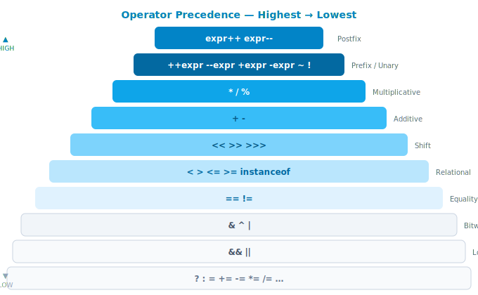

# Toán tử (Operators)

## 1. Khái niệm

Toán tử là ký hiệu hoặc từ khoá yêu cầu JVM thực hiện một phép tính trên một hoặc nhiều **toán hạng** (operand) và trả về một kết quả.

| Nhóm | Toán tử | Trả về |
| --- | --- | --- |
| Số học | `+` `-` `*` `/` `%` `++` `--` | Số |
| Gán | `=` `+=` `-=` `*=` `/=` `%=` … | Giá trị vừa gán |
| So sánh | `==` `!=` `<` `>` `<=` `>=` | `boolean` |
| Logic | `&&` `||` `!` | `boolean` |
| Bit | `&` `|` `^` `~` `<<` `>>` `>>>` | Số nguyên |
| Tam phân | `? :` | Giá trị của nhánh được chọn |
| Kiểu | `instanceof` | `boolean` |

---

## 2. Tại sao quan trọng

Toán tử là thành phần không thể thiếu trong mọi biểu thức Java. Hiểu rõ chúng giải thích:

- Tại sao `5 / 2` trả về `2`, không phải `2.5`
- Tại sao `i++` và `++i` cho kết quả khác nhau trong cùng một biểu thức
- Tại sao dùng `&` thay `&&` có thể gây `NullPointerException`
- Tại sao `int` overflow âm thầm mà không báo lỗi

Đây cũng là chủ đề xuất hiện thường xuyên trong các bài test kỹ thuật ở vòng phỏng vấn Junior.

---

## 3. Toán tử số học

| Toán tử | Ý nghĩa | Ví dụ (`a=10, b=3`) | Kết quả |
| --- | --- | --- | --- |
| `+` | Cộng | `a + b` | `13` |
| `-` | Trừ | `a - b` | `7` |
| `*` | Nhân | `a * b` | `30` |
| `/` | Chia | `a / b` | `3` (**không phải 3.33**) |
| `%` | Lấy dư | `a % b` | `1` |
| `++` | Tăng 1 | `a++` / `++a` | Xem bên dưới |
| `--` | Giảm 1 | `a--` / `--a` | Xem bên dưới |

### Phép chia số nguyên

Khi cả hai toán hạng đều là `int` hoặc `long`, Java **cắt bỏ phần thập phân** — không làm tròn:

```java
System.out.println(5 / 2);     // 2  — không phải 2.5
System.out.println(-7 / 2);    // -3 — cắt về phía 0
System.out.println(7 % 2);     // 1
System.out.println(-7 % 2);    // -1 — dấu theo số bị chia

// Muốn kết quả thực: ép kiểu một bên thành double
System.out.println((double) 5 / 2); // 2.5
```

### Prefix (`++i`) vs Postfix (`i++`)

```java
int i = 5;

// Postfix — trả về giá trị CŨ, rồi mới tăng
System.out.println(i++); // in ra 5, sau đó i = 6

// Prefix — tăng TRƯỚC, rồi mới trả về
System.out.println(++i); // i = 7, in ra 7
```

!!! warning "Quy tắc thực hành"
    Không dùng `++`/`--` bên trong một biểu thức phức tạp — dễ nhầm và khó đọc.
    Chỉ dùng chúng trên dòng riêng: `i++;` hoặc `++i;`

---

## 4. Toán tử gán

Toán tử gán kết hợp (`+=`, `-=`, …) là cách viết tắt và không chỉ tiện lợi hơn — chúng còn chèn **ép kiểu ngầm** về kiểu của bên trái:

```java
// Toán tử gán cơ bản
int x = 10;

// Toán tử gán kết hợp — tương đương với x = (int)(x + 5)
x += 5;   // 15
x -= 3;   // 12
x *= 2;   // 24
x /= 4;   // 6
x %= 4;   // 2
```

```java
// Ép kiểu ngầm trong gán kết hợp
byte b = 10;
b += 5;   // ✅ hợp lệ — trình biên dịch tự thêm (byte) ép kiểu
// b = b + 5; // ❌ lỗi biên dịch — b + 5 là int, không thể gán về byte
```

---

## 5. Toán tử so sánh

Luôn trả về `boolean`. Dùng để đặt điều kiện trong `if`, vòng lặp, biểu thức tam phân.

| Toán tử | Ý nghĩa | Ví dụ | Kết quả |
| --- | --- | --- | --- |
| `==` | Bằng | `5 == 5` | `true` |
| `!=` | Khác | `5 != 3` | `true` |
| `<` | Nhỏ hơn | `3 < 5` | `true` |
| `>` | Lớn hơn | `5 > 3` | `true` |
| `<=` | Nhỏ hơn hoặc bằng | `5 <= 5` | `true` |
| `>=` | Lớn hơn hoặc bằng | `4 >= 5` | `false` |

!!! danger "`==` với đối tượng so sánh địa chỉ, không so sánh nội dung"
    Đây là nguồn gốc của nhiều bug khó phát hiện. Xem lại bài 02 (Kiểu dữ liệu) để hiểu rõ hơn.

```java
String s1 = new String("Java");
String s2 = new String("Java");
System.out.println(s1 == s2);      // false — hai địa chỉ khác nhau trên Heap
System.out.println(s1.equals(s2)); // true  — cùng nội dung
```

---

## 6. Toán tử logic

### Short-circuit: `&&` và `||`

`&&` và `||` sử dụng **short-circuit evaluation** — vế phải **không được tính** nếu kết quả đã xác định từ vế trái:

```java
// && — nếu vế trái là false, không cần kiểm tra vế phải
if (list != null && list.size() > 0) {
    // An toàn: nếu list == null, list.size() không được gọi
}

// || — nếu vế trái là true, không cần kiểm tra vế phải
if (isAdmin || hasPermission(user)) {
    // Nếu isAdmin là true, hasPermission() không được gọi
}
```

### Non-short-circuit: `&` và `|`

`&` và `|` **luôn tính cả hai vế** — không có short-circuit:

```java
String str = null;

// Nguy hiểm — gây NPE dù str == null
if (str != null & str.length() > 0) { ... }

// An toàn — str.length() không được gọi nếu str == null
if (str != null && str.length() > 0) { ... }
```

!!! tip "Quy tắc"
    Luôn dùng `&&` và `||` cho điều kiện logic. `&` và `|` dành cho phép tính bit.

### Toán tử phủ định `!`

```java
boolean isActive = true;
System.out.println(!isActive);       // false
System.out.println(!(5 > 3));        // false
System.out.println(!list.isEmpty()); // true nếu list có phần tử
```

---

## 7. Toán tử bit

Hoạt động trực tiếp trên từng bit của số nguyên. Thường gặp trong hệ thống permission, mã hoá, tối ưu hiệu năng.

| Toán tử | Tên | Ví dụ | Kết quả |
| --- | --- | --- | --- |
| `&` | AND | `0b1010 & 0b1100` | `0b1000` (8) |
| `|` | OR | `0b1010 | 0b1100` | `0b1110` (14) |
| `^` | XOR | `0b1010 ^ 0b1100` | `0b0110` (6) |
| `~` | NOT (bù 1) | `~5` | `-6` |
| `<<` | Dịch trái | `1 << 3` | `8` (nhân với 2³) |
| `>>` | Dịch phải có dấu | `16 >> 2` | `4` (chia cho 2²) |
| `>>>` | Dịch phải không dấu | `-1 >>> 28` | `15` |

```java
// Dùng bit để quản lý permission (ví dụ thực tế)
int READ    = 0b001; // 1
int WRITE   = 0b010; // 2
int EXECUTE = 0b100; // 4

int userPermission = READ | WRITE; // 0b011 = 3

boolean canRead    = (userPermission & READ)    != 0; // true
boolean canExecute = (userPermission & EXECUTE) != 0; // false
```

!!! note "`>>` vs `>>>`"
    `>>` giữ bit dấu (số âm vẫn âm sau khi dịch).
    `>>>` điền `0` vào bit cao nhất bất kể dấu — dùng khi xử lý dữ liệu nhị phân thuần tuý.

---

## 8. Toán tử tam phân

Cú pháp: `điều_kiện ? giá_trị_nếu_đúng : giá_trị_nếu_sai`

```java
int a = 10, b = 20;
int max = (a > b) ? a : b;            // 20
String label = (max > 15) ? "lớn" : "nhỏ"; // "lớn"
```

Dùng khi biểu thức đơn giản, một dòng. **Không lồng nhiều tầng** — làm code khó đọc:

```java
// ❌ Khó đọc — nên thay bằng if/else
String grade = score >= 90 ? "A" : score >= 70 ? "B" : score >= 50 ? "C" : "F";

// ✅ Rõ ràng hơn
String grade;
if      (score >= 90) grade = "A";
else if (score >= 70) grade = "B";
else if (score >= 50) grade = "C";
else                  grade = "F";
```

---

## 9. `instanceof` và Pattern Matching (Java 16+)

`instanceof` kiểm tra xem một đối tượng có phải là thể hiện của một kiểu hay không.

### Cú pháp cổ điển (trước Java 16)

```java
Object obj = "Hello Java";

if (obj instanceof String) {
    String s = (String) obj; // phải ép kiểu thủ công
    System.out.println(s.toUpperCase());
}
```

### Pattern Matching (Java 16+, JEP 394)

Kết hợp kiểm tra kiểu và khai báo biến vào một bước — biến `s` chỉ tồn tại trong phạm vi `if` (preview Java 14–15 qua JEP 305/375, chính thức từ Java 16 qua JEP 394):

```java
if (obj instanceof String s) {
    System.out.println(s.toUpperCase()); // s đã được ép kiểu, không cần cast
}
```

Pattern matching hoạt động tốt với `switch` (Java 21+):

```java
Object shape = new Circle(5.0);

String desc = switch (shape) {
    case Circle c    -> "Hình tròn, bán kính " + c.radius();
    case Rectangle r -> "Hình chữ nhật " + r.width() + "x" + r.height();
    default          -> "Hình không xác định";
};
```

---

## 10. Thứ tự ưu tiên toán tử

Khi một biểu thức chứa nhiều toán tử, Java áp dụng thứ tự ưu tiên (từ cao xuống thấp):

| Độ ưu tiên | Toán tử | Ghi chú |
| --- | --- | --- |
| 1 (cao nhất) | `expr++` `expr--` | Postfix |
| 2 | `++expr` `--expr` `+expr` `-expr` `~` `!` | Prefix / Unary |
| 3 | `*` `/` `%` | Nhân chia |
| 4 | `+` `-` | Cộng trừ |
| 5 | `<<` `>>` `>>>` | Dịch bit |
| 6 | `<` `>` `<=` `>=` `instanceof` | So sánh quan hệ |
| 7 | `==` `!=` | So sánh bằng |
| 8 | `&` | Bitwise AND |
| 9 | `^` | Bitwise XOR |
| 10 | `|` | Bitwise OR |
| 11 | `&&` | Logic AND |
| 12 | `||` | Logic OR |
| 13 | `? :` | Tam phân |
| 14 (thấp nhất) | `=` `+=` `-=` … | Gán |



```java
// Không dùng ngoặc — dễ nhầm
int result = 2 + 3 * 4; // 14, không phải 20 (nhân trước)

// Dùng ngoặc — rõ ràng và an toàn
int result = (2 + 3) * 4; // 20
```

!!! tip "Thực hành tốt"
    Khi không chắc về thứ tự ưu tiên, hãy thêm ngoặc. Code rõ ràng quan trọng hơn code ngắn.

---

## 11. Code ví dụ

!!! info "Verified"
    Bản đầy đủ có thể compile: [`OperatorsDemo.java`](https://github.com/minhdao-dev/java-docs/blob/main/examples/src/main/java/fundamentals/operators/OperatorsDemo.java)

```java linenums="1"
public class OperatorsDemo {

    public static void main(String[] args) {

        // ── Số học ─────────────────────────────────────────────
        int a = 10, b = 3;
        System.out.println(a / b);          // 3  — chia nguyên, cắt bỏ phần thập phân
        System.out.println((double) a / b); // 3.3333...
        System.out.println(a % b);          // 1

        // ── Prefix vs Postfix ──────────────────────────────────
        int x = 5;
        System.out.println(x++); // 5 — in trước, tăng sau
        System.out.println(x);   // 6
        System.out.println(++x); // 7 — tăng trước, in sau

        // ── Short-circuit ──────────────────────────────────────
        String str = null;
        boolean safe = (str != null && str.length() > 0); // không NPE
        System.out.println(safe); // false

        // ── Toán tử bit ───────────────────────────────────────
        int READ    = 1, WRITE = 2, EXECUTE = 4;
        int perm    = READ | WRITE;               // 3 = 0b011
        System.out.println((perm & READ)    != 0); // true
        System.out.println((perm & EXECUTE) != 0); // false

        // ── Tam phân ──────────────────────────────────────────
        int score = 85;
        String grade = (score >= 90) ? "A" : (score >= 70) ? "B" : "C";
        System.out.println(grade); // "B"

        // ── instanceof pattern matching (Java 16+) ─────────────
        Object obj = "Hello";
        if (obj instanceof String s) {
            System.out.println(s.toUpperCase()); // HELLO — không cần cast
        }

        // ── Overflow ngầm ─────────────────────────────────────
        int max = Integer.MAX_VALUE;
        System.out.println(max + 1); // -2147483648 — overflow, không báo lỗi
    }
}
```

---

## 12. Lỗi thường gặp

### Lỗi 1 — Chia nguyên khi cần kết quả thực

```java
int a = 5, b = 2;
double result = a / b;         // ❌ 2.0 — chia nguyên rồi mới gán về double

double result = (double) a / b; // ✅ 2.5
double result = a / (double) b; // ✅ 2.5
double result = 1.0 * a / b;   // ✅ 2.5
```

### Lỗi 2 — Nhầm vị trí `++` trong biểu thức

```java
int i = 5;
int result = i++ * 2; // ❌ ý định là 6*2=12 nhưng kết quả là 5*2=10
                      // vì i++ trả về 5 trước khi tăng

// Viết tách ra — rõ ràng, không lỗi
i++;
int result = i * 2;   // ✅ 12
```

### Lỗi 3 — Dùng `&` thay `&&` cho điều kiện logic

```java
String s = null;

// ❌ NPE — & không short-circuit, s.isEmpty() được gọi dù s == null
if (s != null & s.isEmpty()) { ... }

// ✅ An toàn
if (s != null && s.isEmpty()) { ... }
```

### Lỗi 4 — Bỏ qua overflow của `int`

```java
int a = 2_000_000_000;
int b = 2_000_000_000;
int sum = a + b; // ❌ overflow âm thầm, kết quả là -294967296

long sum = (long) a + b; // ✅ ép kiểu trước khi cộng
```

### Lỗi 5 — Nhầm thứ tự ưu tiên

```java
boolean result = 2 + 3 == 5 && 10 / 2 == 5; // true — rõ khi biết ưu tiên
boolean tricky = true || false && false;      // true — && được tính trước ||

// Luôn dùng ngoặc để rõ ý định
boolean clear = true || (false && false);     // ✅
```

---

## 13. Câu hỏi phỏng vấn

**Q1: `5 / 2` trong Java trả về bao nhiêu? Tại sao?**

> `2`. Khi cả hai toán hạng là kiểu nguyên (`int`, `long`), Java thực hiện **chia nguyên** —
> cắt bỏ phần thập phân về phía 0. Để có `2.5`, phải ép kiểu: `(double) 5 / 2`.

**Q2: Sự khác biệt giữa `&&` và `&` trong Java?**

> `&&` là toán tử logic với **short-circuit**: nếu vế trái là `false`, vế phải không được tính.
> `&` là toán tử bit (và cũng là logic AND không short-circuit): luôn tính cả hai vế.
> Dùng `&` trong điều kiện logic có thể gây `NullPointerException` nếu vế phải truy cập object null.

**Q3: `i++` và `++i` khác nhau thế nào?**

> Cả hai đều tăng `i` lên 1, nhưng **giá trị trả về** khác nhau:
> `i++` (postfix) trả về giá trị **cũ** trước khi tăng.
> `++i` (prefix) trả về giá trị **mới** sau khi tăng.
> Sự khác biệt chỉ quan trọng khi chúng nằm trong một biểu thức lớn hơn.

**Q4: Pattern matching với `instanceof` (Java 16+) có lợi gì?**

> Gộp việc kiểm tra kiểu và ép kiểu vào một bước, loại bỏ cast thủ công và giảm rủi ro `ClassCastException`.
> `if (obj instanceof String s)` — nếu điều kiện đúng, `s` đã sẵn sàng dùng ngay trong block.
> (Lịch sử: preview Java 14–15, JEP 305/375; chính thức Java 16, JEP 394.)

**Q5: `>>` và `>>>` khác nhau thế nào?**

> `>>` là **dịch phải có dấu**: bit dấu (bit cao nhất) được sao chép vào — số âm vẫn âm.
> `>>>` là **dịch phải không dấu**: luôn điền `0` vào bit cao nhất — kết quả luôn không âm.
> Ví dụ: `-8 >> 1 = -4`, nhưng `-8 >>> 1 = 2147483644`.

**Q6: Điều gì xảy ra khi `int` bị overflow?**

> Java không ném exception — kết quả âm thầm quay vòng (wrap around) theo số học modulo 2³².
> `Integer.MAX_VALUE + 1 = Integer.MIN_VALUE`. Dùng `long` hoặc `Math.addExact()` nếu cần phát hiện overflow.

---

## 14. Tham khảo thêm

| Tài liệu | Nội dung |
| --- | --- |
| [JLS §15 — Expressions](https://docs.oracle.com/javase/specs/jls/se21/html/jls-15.html) | Đặc tả toán tử và thứ tự ưu tiên |
| [JEP 394 — Pattern Matching for instanceof](https://openjdk.org/jeps/394) | Pattern matching (Java 16) |
| [JEP 441 — Pattern Matching for switch](https://openjdk.org/jeps/441) | Switch pattern matching (Java 21) |
| *Effective Java* — Joshua Bloch | Item 31: Prefer primitive types · Item 49: Check parameters |
| [Oracle Java Tutorial — Operators](https://docs.oracle.com/javase/tutorial/java/nutsandbolts/operators.html) | Hướng dẫn chính thức |
