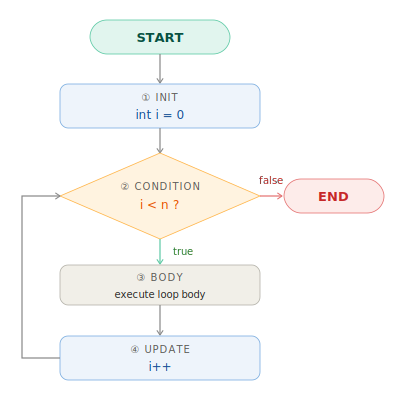
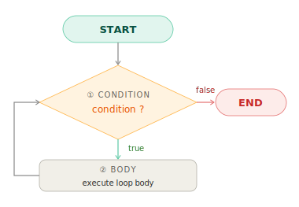
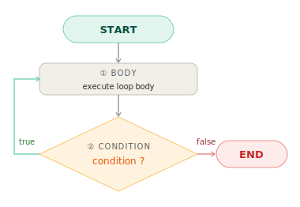

# Vòng lặp — for / while / do-while / for-each

## 1. Khái niệm

Vòng lặp cho phép thực thi một khối code **nhiều lần** mà không cần viết lặp lại. Thay vì:

```java
System.out.println(1);
System.out.println(2);
// ... 98 dòng nữa
System.out.println(100);
```

Ta viết gọn trong 3 dòng:

```java
for (int i = 1; i <= 100; i++) {
    System.out.println(i);
}
```

Java cung cấp bốn loại vòng lặp, mỗi loại phù hợp với một tình huống khác nhau:

| Loại | Dùng khi |
| --- | --- |
| `for` | Biết trước số lần lặp |
| `while` | Lặp đến khi điều kiện sai, kiểm tra **trước** |
| `do-while` | Lặp ít nhất một lần, kiểm tra **sau** |
| `for-each` | Duyệt qua từng phần tử của array / collection |

---

## 2. Tại sao quan trọng

Vòng lặp xuất hiện trong mọi ứng dụng thực tế: xử lý danh sách, tìm kiếm, tổng hợp dữ liệu, đọc file. Hiểu rõ chúng giúp:

- Chọn đúng loại vòng lặp cho từng bài toán
- Tránh **infinite loop** — lỗi treo chương trình
- Tránh **off-by-one error** — lỗi sai lệch 1 phần tử rất kinh điển
- Hiểu hiệu năng: dùng index với `LinkedList` trong vòng lặp là O(n²), không phải O(n)

---

## 3. Vòng lặp for

Dùng khi biết trước số lần lặp. Cú pháp gồm ba phần, cách nhau bởi `;`:

```java
for (khởi_tạo; điều_kiện; cập_nhật) {
    // thân vòng lặp
}
```

**Luồng thực thi:**



```java
for (int i = 1; i <= 5; i++) {
    System.out.print(i + " "); // 1 2 3 4 5
}
```

Mỗi phần trong `for` đều tùy chọn — bỏ trống tất cả là infinite loop:

```java
for (;;) { // tương đương while (true)
    break;  // cần có điều kiện thoát bên trong
}
```

### Đếm ngược

```java
for (int i = 5; i >= 1; i--) {
    System.out.print(i + " "); // 5 4 3 2 1
}
```

### Bước nhảy tùy chỉnh

```java
for (int i = 0; i <= 10; i += 2) {
    System.out.print(i + " "); // 0 2 4 6 8 10
}
```

### Hai biến đếm cùng lúc

```java
// Đảo ngược mảng tại chỗ
for (int i = 0, j = arr.length - 1; i < j; i++, j--) {
    int temp = arr[i];
    arr[i] = arr[j];
    arr[j] = temp;
}
```

---

## 4. Vòng lặp while

Dùng khi không biết trước số lần lặp — chỉ biết điều kiện dừng. **Kiểm tra điều kiện trước** khi thực thi thân:



```java
// Tính số chữ số của một số nguyên
int n = 12345;
int count = 0;

while (n > 0) {
    n /= 10;
    count++;
}
System.out.println(count); // 5
```

```java
// Đọc input đến khi nhập -1
Scanner scanner = new Scanner(System.in);
int input = scanner.nextInt();

while (input != -1) {
    System.out.println("Nhận: " + input);
    input = scanner.nextInt();
}
```

!!! warning "Tránh infinite loop"
    Biến điều kiện bắt buộc phải được cập nhật bên trong thân vòng lặp.

    ```java
    int i = 0;
    while (i < 5) {
        System.out.println(i);
        // ❌ quên i++ → lặp mãi mãi
    }
    ```

---

## 5. Vòng lặp do-while

Giống `while` nhưng **kiểm tra điều kiện sau** — thân luôn được thực thi **ít nhất một lần**:



```java
// Hiển thị menu, yêu cầu nhập hợp lệ
int choice;
do {
    System.out.println("1. Thêm  2. Sửa  3. Xóa  0. Thoát");
    System.out.print("Chọn: ");
    choice = scanner.nextInt();
} while (choice < 0 || choice > 3);
```

!!! tip "Khi nào dùng do-while"
    Điển hình nhất: **menu nhập liệu** và **validate input** — khi cần hiển thị/thực hiện trước, rồi mới hỏi có tiếp tục không.

    Trong thực tế `do-while` ít gặp hơn `for` và `while` đáng kể.

---

## 6. Vòng lặp for-each

Cú pháp gọn để duyệt qua mọi phần tử của **array** hoặc bất kỳ **Iterable** (List, Set, ...):

```java
for (KiểuPhầnTử biến : collection) {
    // dùng biến
}
```

```java
// Duyệt array
int[] scores = {85, 92, 78, 95, 88};
int total = 0;

for (int score : scores) {
    total += score;
}
System.out.println("Trung bình: " + total / scores.length); // 87

// Duyệt List
List<String> names = List.of("An", "Bình", "Chi");

for (String name : names) {
    System.out.println("Xin chào, " + name);
}
```

### Hạn chế của for-each

| Không làm được với for-each | Giải pháp |
| --- | --- |
| Truy cập chỉ số hiện tại | Dùng `for` truyền thống hoặc `IntStream.range()` |
| Sửa giá trị phần tử trong array | Dùng `for` với index |
| Duyệt ngược | Dùng `for` đếm ngược |
| Xóa phần tử trong List | Dùng `removeIf()` hoặc `Iterator` |

!!! danger "Sửa collection trong for-each gây ConcurrentModificationException"

    ```java
    List<String> list = new ArrayList<>(List.of("a", "b", "c"));

    for (String s : list) {
        if (s.equals("b")) list.remove(s); // ❌ ConcurrentModificationException
    }

    // ✅ Cách đúng — Java 8+
    list.removeIf(s -> s.equals("b"));
    ```

---

## 7. So sánh 4 loại vòng lặp

Cùng in số từ 1 đến 5 bằng cả bốn cách:

=== "`for`"

    ```java
    for (int i = 1; i <= 5; i++) {
        System.out.println(i);
    }
    ```

    Tốt nhất khi biết trước số lần lặp. Biến đếm `i` được gói gọn trong scope của vòng lặp.

=== "`while`"

    ```java
    int i = 1;
    while (i <= 5) {
        System.out.println(i);
        i++;
    }
    ```

    Phù hợp khi điều kiện dừng phức tạp hơn bộ đếm đơn giản. Biến `i` tồn tại sau vòng lặp.

=== "`do-while`"

    ```java
    int i = 1;
    do {
        System.out.println(i);
        i++;
    } while (i <= 5);
    ```

    Thân được thực thi trước, điều kiện kiểm tra sau. Ít dùng nhất trong bốn loại.

=== "`for-each`"

    ```java
    int[] numbers = {1, 2, 3, 4, 5};
    for (int n : numbers) {
        System.out.println(n);
    }
    ```

    Không có index, không thể dừng giữa chừng bằng logic. Rõ ràng nhất khi chỉ cần duyệt.

---

## 8. break và continue

### break — thoát vòng lặp ngay lập tức

```java
// Tìm phần tử đầu tiên lớn hơn 10
int[] numbers = {3, 7, 12, 5, 18};

for (int n : numbers) {
    if (n > 10) {
        System.out.println("Tìm thấy: " + n); // 12
        break;
    }
}
```

### continue — bỏ qua lần lặp hiện tại

```java
// In số lẻ từ 1 đến 10
for (int i = 1; i <= 10; i++) {
    if (i % 2 == 0) continue; // bỏ qua số chẵn
    System.out.print(i + " "); // 1 3 5 7 9
}
```

### Labeled break — thoát vòng lặp lồng nhau

Mặc định `break` chỉ thoát vòng lặp **trong cùng**. Label cho phép thoát ra vòng lặp ngoài:

```java
int target = 15;

outer:
for (int i = 1; i <= 5; i++) {
    for (int j = 1; j <= 5; j++) {
        if (i * j == target) {
            System.out.println("Tìm thấy: " + i + " × " + j); // 3 × 5
            break outer; // thoát khỏi cả hai vòng lặp
        }
    }
}
```

??? tip "Labeled break trong thực tế"
    Labeled break hữu ích nhưng làm luồng code khó theo dõi. Trong thực tế nên ưu tiên trích xuất thành method riêng và dùng `return` — rõ ràng hơn nhiều:

    ```java
    // Thay vì labeled break
    private int[] findPair(int[][] matrix, int target) {
        for (int i = 0; i < matrix.length; i++) {
            for (int j = 0; j < matrix[i].length; j++) {
                if (matrix[i][j] == target) return new int[]{i, j};
            }
        }
        return new int[]{-1, -1};
    }
    ```

---

## 9. Vòng lặp lồng nhau

Mỗi lần lặp của vòng ngoài, vòng trong chạy **hoàn chỉnh một chu kỳ**. Độ phức tạp là O(n × m).

```java
// Bảng nhân 3×3
for (int i = 1; i <= 3; i++) {
    for (int j = 1; j <= 3; j++) {
        System.out.printf("%4d", i * j);
    }
    System.out.println();
}
// Output:
//    1   2   3
//    2   4   6
//    3   6   9
```

```java
// Tam giác sao
for (int i = 1; i <= 5; i++) {
    for (int j = 1; j <= i; j++) {
        System.out.print("* ");
    }
    System.out.println();
}
// Output:
// *
// * *
// * * *
// * * * *
// * * * * *
```

!!! warning "Cẩn thận khi lồng sâu"
    Ba tầng lồng nhau trở lên thường là dấu hiệu cần refactor — trích xuất vòng lặp trong thành method riêng.

---

## 10. Code ví dụ

```java linenums="1"
import java.util.ArrayList;
import java.util.List;

public class LoopsDemo {

    static int sum(int[] arr) {
        int total = 0;
        for (int x : arr) total += x;
        return total;
    }

    static int max(int[] arr) {
        int max = arr[0]; // (1)
        for (int i = 1; i < arr.length; i++) {
            if (arr[i] > max) max = arr[i];
        }
        return max;
    }

    static void reverse(int[] arr) {
        for (int i = 0, j = arr.length - 1; i < j; i++, j--) { // (2)
            int temp = arr[i];
            arr[i]   = arr[j];
            arr[j]   = temp;
        }
    }

    static int linearSearch(int[] arr, int target) {
        for (int i = 0; i < arr.length; i++) {
            if (arr[i] == target) return i; // (3)
        }
        return -1;
    }

    static List<Integer> evenOnly(List<Integer> numbers) {
        List<Integer> result = new ArrayList<>(numbers);
        result.removeIf(n -> n % 2 != 0); // (4)
        return result;
    }

    public static void main(String[] args) {
        int[] scores = {85, 92, 78, 95, 88};

        System.out.println("Tổng: "      + sum(scores));                  // 438
        System.out.println("Lớn nhất: "  + max(scores));                  // 95
        System.out.println("Vị trí 78: " + linearSearch(scores, 78));     // 2

        reverse(scores);
        System.out.print("Đảo ngược: ");
        for (int s : scores) System.out.print(s + " ");                    // 88 95 78 92 85
        System.out.println();

        var nums = new ArrayList<>(List.of(1, 2, 3, 4, 5, 6));
        System.out.println("Số chẵn: " + evenOnly(nums));                  // [2, 4, 6]
    }
}
```

1. Khởi tạo `max` từ phần tử đầu tiên thay vì `Integer.MIN_VALUE` — tránh phụ thuộc vào hằng số ma thuật khi không cần thiết.
2. Hai biến đếm trong một `for`: `i` đi từ đầu, `j` đi từ cuối — gặp nhau ở giữa là xong.
3. Early return ngay khi tìm thấy — không cần cờ `boolean` hay biến `result` thêm.
4. `removeIf` với lambda gọn hơn `Iterator` truyền thống và không gây `ConcurrentModificationException`.

---

## 11. Lỗi thường gặp

### Lỗi 1 — Off-by-one error

```java
int[] arr = {1, 2, 3, 4, 5}; // length = 5, index 0-4

for (int i = 0; i <= arr.length; i++) { // ❌ i <= 5 → truy cập arr[5] → ArrayIndexOutOfBoundsException
    System.out.println(arr[i]);
}

for (int i = 0; i < arr.length; i++) {  // ✅ i < 5
    System.out.println(arr[i]);
}
```

### Lỗi 2 — Infinite loop

```java
int i = 0;
while (i < 5) {
    System.out.println(i);
    // ❌ quên i++ → lặp mãi mãi với i = 0
}

for (int j = 1; j > 0; j++) { // ❌ j luôn dương và tăng dần → không bao giờ dừng
    // ...
}
```

### Lỗi 3 — Sửa collection trong for-each

```java
List<String> list = new ArrayList<>(List.of("a", "b", "c"));

for (String s : list) {
    if (s.equals("b")) list.remove(s); // ❌ ConcurrentModificationException
}

// ✅ Cách 1 — removeIf (Java 8+, gọn nhất)
list.removeIf(s -> s.equals("b"));

// ✅ Cách 2 — Iterator thủ công
Iterator<String> it = list.iterator();
while (it.hasNext()) {
    if (it.next().equals("b")) it.remove();
}
```

### Lỗi 4 — Autoboxing trong vòng lặp lớn

```java
Long sum = 0L;
for (long i = 0; i < 1_000_000; i++) {
    sum += i; // ❌ unbox → cộng → tạo Long mới → gán lại — 1 triệu object rác
}

long sum = 0L;
for (long i = 0; i < 1_000_000; i++) {
    sum += i; // ✅ thuần primitive, không tạo object nào
}
```

### Lỗi 5 — Index-based access với LinkedList

```java
List<String> linked = new LinkedList<>(/* 10000 phần tử */);

// ❌ O(n²) — mỗi get(i) phải duyệt từ đầu LinkedList
for (int i = 0; i < linked.size(); i++) {
    System.out.println(linked.get(i));
}

// ✅ O(n) — Iterator duyệt tuần tự, đúng cách với LinkedList
for (String s : linked) {
    System.out.println(s);
}
```

---

## 12. Câu hỏi phỏng vấn

**Q1: Sự khác biệt giữa `while` và `do-while`?**

> `while` kiểm tra điều kiện **trước** — thân có thể không được thực thi lần nào. `do-while` kiểm tra **sau** — thân **luôn thực thi ít nhất một lần** dù điều kiện ngay lập tức là `false`.

**Q2: Off-by-one error là gì? Làm sao tránh?**

> Lỗi sai lệch 1 vị trí — điển hình là dùng `<=` thay vì `<` với index mảng gây `ArrayIndexOutOfBoundsException`, hoặc ngược lại bỏ sót phần tử cuối. Tránh bằng cách xác định rõ boundary theo đặc tả bài toán: với mảng 0-indexed thì điều kiện luôn là `i < length`.

**Q3: Tại sao không được sửa collection trong for-each?**

> `for-each` dùng `Iterator` nội bộ. Khi sửa collection trực tiếp trong khi Iterator đang duyệt, Iterator phát hiện thay đổi cấu trúc (modCount thay đổi) và ném `ConcurrentModificationException`. Giải pháp: `removeIf()`, Iterator thủ công, hoặc tạo danh sách mới.

**Q4: Khi nào dùng `for` truyền thống thay vì `for-each`?**

> Khi cần: (1) chỉ số hiện tại (`i`), (2) bước nhảy tùy chỉnh (`i += 2`), (3) duyệt ngược, (4) sửa phần tử trong array. Mọi trường hợp khác ưu tiên `for-each` — rõ ràng hơn và không thể `ArrayIndexOutOfBoundsException`.

**Q5: Tại sao dùng index với `LinkedList` trong vòng lặp là vấn đề hiệu năng?**

> `LinkedList.get(i)` phải duyệt từ đầu qua `i` node — O(i). Trong vòng lặp n lần, tổng là O(1 + 2 + ... + n) = O(n²). `for-each` dùng `Iterator` di chuyển tuần tự — O(n) tổng thể, hiệu quả hơn n lần.

---

## 13. Tài liệu tham khảo

| Tài liệu | Nội dung |
| --- | --- |
| [JLS §14.13 — The for Statement](https://docs.oracle.com/javase/specs/jls/se21/html/jls-14.html#jls-14.14) | Đặc tả chính thức |
| [JLS §14.12 — The while Statement](https://docs.oracle.com/javase/specs/jls/se21/html/jls-14.html#jls-14.12) | Đặc tả while / do-while |
| [Oracle Java Tutorial — The for Statement](https://docs.oracle.com/javase/tutorial/java/nutsandbolts/for.html) | Hướng dẫn chính thức |
| *Effective Java* — Joshua Bloch | Item 58: Prefer for-each loops over traditional for loops |
| *Clean Code* — Robert C. Martin | Chapter 3: Functions — keep loops small and extracted |
