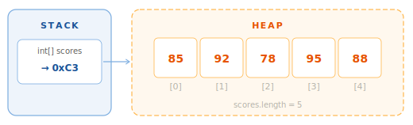
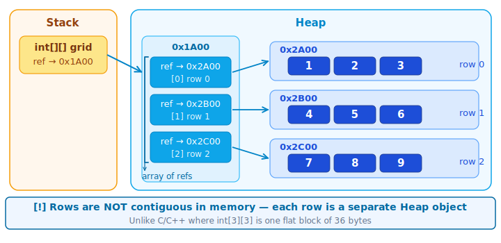

# Arrays — 1D & 2D

## 1. What is it

An array is a data structure that stores a sequence of elements of the **same type**, with a **fixed size**, indexed from `0`.

```java
int[] scores = {85, 92, 78, 95, 88};
//              [0] [1] [2] [3] [4]
```



Three core characteristics:

- **Fixed-size** — size is set at creation and **cannot change** afterwards
- **Zero-indexed** — first element at index `0`, last at index `length - 1`
- **Heap-allocated** — the Stack variable holds only a **reference** (address); the actual data lives on the Heap

---

## 2. Why it matters

Arrays are the foundation of every data structure in Java:

- `ArrayList` internally uses an `Object[]` to store elements
- `HashMap` internally is an array of buckets
- Sorting and searching algorithms all start with arrays
- Common interview patterns: two-pointer, sliding window, prefix sum — all on arrays

---

## 3. Declaration and initialization

### Three ways to declare a 1D array

```java
// Way 1 — allocate only, no values yet (uses default values)
int[] scores = new int[5]; // [0, 0, 0, 0, 0]

// Way 2 — declare + initialize with values (most common)
int[] scores = {85, 92, 78, 95, 88};

// Way 3 — new + initializer (useful when passing directly to a method)
printArray(new int[]{85, 92, 78, 95, 88});
```

### Default values when using `new`

| Type | Default value |
| --- | --- |
| `int`, `long`, `short`, `byte` | `0` |
| `double`, `float` | `0.0` |
| `boolean` | `false` |
| `char` | `' '` |
| Object (`String`, ...) | `null` |

```java
int[] arr = new int[3];
System.out.println(arr[0]); // 0

String[] names = new String[3];
System.out.println(names[0]); // null
```

### Accessing elements and properties

```java
int[] scores = {85, 92, 78, 95, 88};

System.out.println(scores[0]);     // 85 — first element
System.out.println(scores[4]);     // 88 — last element
System.out.println(scores.length); // 5 — field, no parentheses
scores[2] = 80;                    // reassign a value
```

!!! warning "`.length` is a field, not a method"
    `arr.length` — **no parentheses `()`**. Unlike `String.length()` or `List.size()`. A common mistake when starting out.

---

## 4. Iterating over an array

=== "`for` with index"

    ```java
    int[] scores = {85, 92, 78, 95, 88};

    for (int i = 0; i < scores.length; i++) {
        System.out.println("scores[" + i + "] = " + scores[i]);
    }
    ```

    Use when you need the index `i`, iterate in reverse, or modify elements.

=== "`for-each`"

    ```java
    int[] scores = {85, 92, 78, 95, 88};

    for (int score : scores) {
        System.out.println(score);
    }
    ```

    Cleaner when you only need to **read** each element without an index.

=== "`Arrays.toString()`"

    ```java
    int[] scores = {85, 92, 78, 95, 88};
    System.out.println(Arrays.toString(scores)); // [85, 92, 78, 95, 88]
    ```

    Print the whole array at once — convenient for debugging.

---

## 5. Common operations

### Sum and average

```java
int[] scores = {85, 92, 78, 95, 88};
int sum = 0;

for (int s : scores) sum += s;

double avg = (double) sum / scores.length;
System.out.println("Sum: " + sum);     // 438
System.out.println("Average: " + avg); // 87.6
```

### Find min / max

```java
int[] scores = {85, 92, 78, 95, 88};
int min = scores[0], max = scores[0];

for (int i = 1; i < scores.length; i++) {
    if (scores[i] < min) min = scores[i];
    if (scores[i] > max) max = scores[i];
}
System.out.println("Min: " + min + ", Max: " + max); // Min: 78, Max: 95
```

### Copying an array

```java
int[] original = {1, 2, 3, 4, 5};

// Arrays.copyOf — simplest
int[] copy1 = Arrays.copyOf(original, original.length);

// Arrays.copyOfRange — copy a range [fromIndex, toIndex)
int[] copy2 = Arrays.copyOfRange(original, 1, 4); // [2, 3, 4]

// System.arraycopy — fastest, maximum control
int[] copy3 = new int[original.length];
System.arraycopy(original, 0, copy3, 0, original.length);
```

!!! danger "Never copy an array with `=`"
    ```java
    int[] a = {1, 2, 3};
    int[] b = a;      // ❌ b and a point to the same array
    b[0] = 99;
    System.out.println(a[0]); // 99 — a was modified!

    int[] c = Arrays.copyOf(a, a.length); // ✅ real copy
    ```

---

## 6. 2D arrays

A 2D array is an **array of arrays** — used to represent matrices, tables, or grids.

```java
// Declaration + allocation
int[][] matrix = new int[3][4]; // 3 rows, 4 columns, default 0

// Declaration + initialization
int[][] grid = {
    {1, 2, 3},
    {4, 5, 6},
    {7, 8, 9}
};

// Access: [row][column]
System.out.println(grid[1][2]); // 6

System.out.println(grid.length);    // 3 — number of rows
System.out.println(grid[0].length); // 3 — columns in row 0
```



### Iterating over a 2D array

=== "Nested for"

    ```java
    int[][] grid = {{1, 2, 3}, {4, 5, 6}, {7, 8, 9}};

    for (int i = 0; i < grid.length; i++) {
        for (int j = 0; j < grid[i].length; j++) {
            System.out.printf("%3d", grid[i][j]);
        }
        System.out.println();
    }
    //   1  2  3
    //   4  5  6
    //   7  8  9
    ```

=== "Nested for-each"

    ```java
    int[][] grid = {{1, 2, 3}, {4, 5, 6}, {7, 8, 9}};

    for (int[] row : grid) {
        for (int val : row) {
            System.out.printf("%3d", val);
        }
        System.out.println();
    }
    ```

=== "Print with Arrays"

    ```java
    int[][] grid = {{1, 2, 3}, {4, 5, 6}, {7, 8, 9}};
    System.out.println(Arrays.deepToString(grid));
    // [[1, 2, 3], [4, 5, 6], [7, 8, 9]]
    ```

??? tip "Jagged arrays — rows of different lengths"
    Java allows each row of a 2D array to have a different length:

    ```java
    int[][] triangle = new int[4][];
    for (int i = 0; i < triangle.length; i++) {
        triangle[i] = new int[i + 1];
    }
    // row 0: [0]
    // row 1: [0, 0]
    // row 2: [0, 0, 0]
    // row 3: [0, 0, 0, 0]
    ```

    Unlike C/C++, a Java 2D array is not a contiguous block of memory — it is an array of references to separate row arrays.

---

## 7. java.util.Arrays

`Arrays` is a utility class with the most commonly needed array operations — requires `import java.util.Arrays`.

```java
int[] arr = {5, 2, 8, 1, 9, 3};

// Sort in place
Arrays.sort(arr);
System.out.println(Arrays.toString(arr)); // [1, 2, 3, 5, 8, 9]

// Binary search — array must already be sorted
int idx = Arrays.binarySearch(arr, 5);    // 3

// Fill
int[] filled = new int[5];
Arrays.fill(filled, 7);                   // [7, 7, 7, 7, 7]

// Copy
int[] copy  = Arrays.copyOf(arr, 4);           // [1, 2, 3, 5]
int[] range = Arrays.copyOfRange(arr, 2, 5);   // [3, 5, 8]

// Compare content
int[] a = {1, 2, 3}, b = {1, 2, 3};
System.out.println(Arrays.equals(a, b));       // true
System.out.println(a == b);                    // false — different addresses

// 2D arrays
int[][] x = {{1, 2}, {3, 4}};
int[][] y = {{1, 2}, {3, 4}};
System.out.println(Arrays.deepEquals(x, y));   // true
System.out.println(Arrays.deepToString(x));    // [[1, 2], [3, 4]]
```

---

## 8. Array vs ArrayList

| | `int[]` / `String[]` | `ArrayList<Integer>` |
| --- | --- | --- |
| Size | Fixed | Dynamic, auto-grows |
| Element types | Primitive + Object | Object only (autoboxing) |
| Performance | Higher | Boxed type overhead |
| API | Minimal (`Arrays.*`) | Rich (`add`, `remove`, `contains`...) |
| Use when | Size known upfront, performance matters | Size unknown, frequent add/remove |

!!! tip "Rule of thumb"
    If you know the size and don't need to add/remove elements → use an array. Otherwise → `ArrayList`. Phase 02 covers the full Java Collections Framework.

---

## 9. Code example

```java linenums="1"
import java.util.Arrays;

public class ArraysDemo {

    static int sum(int[] arr) {
        int total = 0;
        for (int x : arr) total += x;
        return total;
    }

    static double average(int[] arr) {
        return (double) sum(arr) / arr.length; // (1)
    }

    static int max(int[] arr) {
        int result = arr[0];
        for (int i = 1; i < arr.length; i++) {
            if (arr[i] > result) result = arr[i];
        }
        return result;
    }

    static int[] twoSum(int[] nums, int target) { // (2)
        for (int i = 0; i < nums.length; i++) {
            for (int j = i + 1; j < nums.length; j++) {
                if (nums[i] + nums[j] == target) return new int[]{i, j};
            }
        }
        return new int[]{-1, -1};
    }

    static void printMatrix(int[][] m) {
        for (int[] row : m) System.out.println(Arrays.toString(row));
    }

    public static void main(String[] args) {
        int[] scores = {85, 92, 78, 95, 88};

        System.out.println("Sum: "     + sum(scores));     // 438
        System.out.println("Average: " + average(scores)); // 87.6
        System.out.println("Max: "     + max(scores));     // 95

        Arrays.sort(scores);
        System.out.println("Sorted: " + Arrays.toString(scores)); // [78, 85, 88, 92, 95]

        int[] nums = {2, 7, 11, 15};
        System.out.println("TwoSum(9): " + Arrays.toString(twoSum(nums, 9))); // [0, 1]

        int[][] grid = {{1, 2, 3}, {4, 5, 6}, {7, 8, 9}};
        printMatrix(grid);
    }
}
```

1. Cast `sum(arr)` to `double` before dividing — without the cast, integer division truncates the decimal, returning `87` instead of `87.6`.
2. `twoSum` is LeetCode #1 — the first problem most people attempt. Understanding arrays and nested loops is enough to solve it in O(n²). A hash map gives O(n) — covered in Phase 02.

---

## 10. Common mistakes

### Mistake 1 — `ArrayIndexOutOfBoundsException`

```java
int[] arr = {1, 2, 3}; // length = 3, valid indices: 0, 1, 2

System.out.println(arr[3]); // ❌ ArrayIndexOutOfBoundsException: index 3 out of bounds for length 3

System.out.println(arr[arr.length - 1]); // ✅ last element is always at length - 1
```

### Mistake 2 — `NullPointerException` with Object arrays

```java
String[] names = new String[3]; // [null, null, null]

System.out.println(names[0].length()); // ❌ NullPointerException

if (names[0] != null) {                // ✅ check before use
    System.out.println(names[0].length());
}
```

### Mistake 3 — Comparing arrays with `==`

```java
int[] a = {1, 2, 3};
int[] b = {1, 2, 3};

System.out.println(a == b);              // false — compares memory addresses
System.out.println(Arrays.equals(a, b)); // true ✅

int[][] x = {{1, 2}, {3, 4}};
int[][] y = {{1, 2}, {3, 4}};
System.out.println(Arrays.deepEquals(x, y)); // true ✅ — must use deepEquals for 2D
```

### Mistake 4 — Assignment `=` mistaken for a copy

```java
int[] original = {1, 2, 3};
int[] alias = original;                    // ❌ same reference
int[] copy   = Arrays.copyOf(original, 3); // ✅ real copy

alias[0] = 99;
System.out.println(original[0]); // 99 — modified!
copy[0]  = 77;
System.out.println(original[0]); // still 99 — safe ✅
```

### Mistake 5 — Printing an array directly

```java
int[] arr = {1, 2, 3};
System.out.println(arr);                   // ❌ [I@6d06d69c — memory address
System.out.println(Arrays.toString(arr));  // ✅ [1, 2, 3]

int[][] m = {{1, 2}, {3, 4}};
System.out.println(Arrays.toString(m));     // ❌ [[I@..., [I@...]
System.out.println(Arrays.deepToString(m)); // ✅ [[1, 2], [3, 4]]
```

---

## 11. Interview questions

**Q1: What is the difference between `Array` and `ArrayList`?**

> An array has fixed size, can hold primitives, and has higher performance. `ArrayList` is dynamically sized, holds only Objects (autoboxing for primitives), and has a richer API. Use an array when size is known upfront and add/remove is not needed; use `ArrayList` for flexibility.

**Q2: How do you properly copy an array? What is a shallow copy?**

> Use `Arrays.copyOf()`, `Arrays.copyOfRange()`, or `System.arraycopy()`. Assignment `b = a` is **not a copy** — it creates another reference pointing to the same array. Note: all the above methods produce a **shallow copy** — if the array contains Objects, only references are copied, not the objects themselves.

**Q3: What are the default values when an array is created with `new`?**

> Numerics → `0`/`0.0`. `boolean` → `false`. `char` → `' '`. Object references → `null`. Java **always initializes** array elements on allocation — there are no "garbage values" like in C/C++.

**Q4: Why can't you use `Arrays.equals()` for 2D arrays?**

> `Arrays.equals()` only compares one level — it compares the elements of the outer array, which are `int[]` references. Two different references pointing to arrays with the same content still return `false`. You must use `Arrays.deepEquals()` for recursive comparison.

**Q5: What prerequisite does `Arrays.binarySearch()` require?**

> The array **must be sorted in ascending order** before calling it. If not sorted, the result is undefined. Typically combine `Arrays.sort()` first, then `binarySearch()`.

---

## 12. References

| Resource | Content |
| --- | --- |
| [JLS §10 — Arrays](https://docs.oracle.com/javase/specs/jls/se21/html/jls-10.html) | Official specification |
| [java.util.Arrays Javadoc](https://docs.oracle.com/en/java/docs/api/java.base/java/util/Arrays.html) | Full API reference |
| [Oracle Tutorial — Arrays](https://docs.oracle.com/javase/tutorial/java/nutsandbolts/arrays.html) | Official tutorial |
| *Effective Java* — Joshua Bloch | Item 28: Prefer lists to arrays (why generics and arrays don't mix) |
