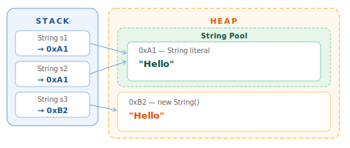

# String và StringBuilder

## 1. Khái niệm

`String` trong Java là một **chuỗi ký tự bất biến (immutable)**. Một khi đã tạo, nội dung bên trong không thể thay đổi — mọi thao tác "chỉnh sửa" đều tạo ra object mới.

```java
String name = "Java";
name = name + " 21"; // không sửa "Java" — tạo object mới "Java 21"
```

`StringBuilder` là phiên bản **mutable** (có thể sửa nội dung tại chỗ) — dùng khi cần xây dựng chuỗi trong vòng lặp hoặc ghép nhiều phần.

---

## 2. Tại sao quan trọng

String xuất hiện ở khắp nơi trong mọi ứng dụng thực tế: tên người dùng, URL, JSON, log message, câu truy vấn SQL... Hiểu đúng String giúp:

- Tránh bug so sánh `==` thay vì `.equals()` — lỗi kinh điển nhất
- Tránh tạo hàng nghìn object thừa khi ghép chuỗi trong vòng lặp
- Hiểu tại sao String an toàn khi dùng làm key trong `HashMap`
- Giải thích được câu hỏi phỏng vấn về immutability và String Pool

---

## 3. String literal và String Pool

Java có một vùng nhớ đặc biệt trong Heap gọi là **String Pool** — nơi lưu trữ các String literal để tái sử dụng.

```java
String s1 = "Hello";           // tạo "Hello" trong pool
String s2 = "Hello";           // tái sử dụng object đã có
String s3 = new String("Hello"); // bắt buộc tạo object mới ngoài pool
```



```java
System.out.println(s1 == s2);        // true  — cùng địa chỉ (cùng object trong pool)
System.out.println(s1 == s3);        // false — s3 là object khác ngoài pool
System.out.println(s1.equals(s3));   // true  — cùng nội dung
```

!!! danger "Luôn dùng `.equals()` để so sánh nội dung String"
    `==` so sánh **địa chỉ bộ nhớ**, không phải nội dung. Chỉ dùng `==` khi bạn cố ý kiểm tra xem hai biến có trỏ vào **cùng một object** hay không — rất hiếm gặp trong thực tế.

---

## 4. String là immutable

**Immutable** có nghĩa là sau khi tạo, object không thể bị thay đổi. Mọi method "sửa" String đều trả về object mới.

```java
String s = "hello";
s.toUpperCase();           // ❌ không làm gì với s — kết quả bị bỏ qua
System.out.println(s);    // hello — s vẫn không đổi

String upper = s.toUpperCase(); // ✅ lưu kết quả vào biến mới
System.out.println(upper); // HELLO
```

### Tại sao Java thiết kế String immutable?

- **An toàn cho HashMap/HashSet** — hash code tính một lần và không đổi
- **Thread-safe** — nhiều thread có thể dùng chung String mà không cần đồng bộ
- **Bảo mật** — password, path, tên class không thể bị thay đổi sau khi kiểm tra
- **String Pool** — chỉ khả thi khi String không thể bị thay đổi sau khi chia sẻ

---

## 5. Các method phổ biến

=== "Tìm kiếm"

    ```java
    String s = "Hello, Java World";

    s.length()                // 17
    s.charAt(7)               // 'J'
    s.indexOf('o')            // 4  — lần xuất hiện đầu tiên
    s.lastIndexOf('o')        // 14 — lần xuất hiện cuối
    s.indexOf("Java")         // 7
    s.contains("Java")        // true
    s.startsWith("Hello")     // true
    s.endsWith("World")       // true
    s.isEmpty()               // false (length > 0)
    s.isBlank()               // false (Java 11 — kiểm tra cả whitespace-only)
    ```

=== "Biến đổi"

    ```java
    String s = "  Hello, Java!  ";

    s.toLowerCase()           // "  hello, java!  "
    s.toUpperCase()           // "  HELLO, JAVA!  "
    s.trim()                  // "Hello, Java!"  — bỏ space đầu/cuối (ASCII)
    s.strip()                 // "Hello, Java!"  — (Java 11) Unicode-aware, dùng strip thay trim
    s.stripLeading()          // "Hello, Java!  "
    s.stripTrailing()         // "  Hello, Java!"
    s.replace('l', 'r')       // "  Herro, Java!  "
    s.replace("Java", "World")// "  Hello, World!  "
    s.replaceAll("\\s+", "_") // dùng regex — thay mọi chuỗi whitespace bằng _
    "ha".repeat(3)            // "hahaha" — Java 11+
    ```

=== "Cắt / tách"

    ```java
    String s = "Hello, Java World";

    s.substring(7)            // "Java World" — từ index 7 đến hết
    s.substring(7, 11)        // "Java"       — [7, 11)

    String csv = "a,b,c,d";
    String[] parts = csv.split(",");     // ["a", "b", "c", "d"]
    String[] two   = csv.split(",", 2);  // ["a", "b,c,d"] — tối đa 2 phần
    ```

    !!! warning "split() nhận regex, không phải plain text"
        `"1.2.3".split(".")` trả về `[]` rỗng vì `.` trong regex nghĩa là "bất kỳ ký tự nào".  
        Dùng `split("\\.")` để tách theo dấu chấm thật sự.

=== "Chuyển đổi"

    ```java
    // String → char array và ngược lại
    char[] chars = "Hello".toCharArray();     // ['H','e','l','l','o']
    String back  = new String(chars);          // "Hello"

    // Primitive → String
    String n = String.valueOf(42);             // "42"
    String d = String.valueOf(3.14);           // "3.14"

    // String → primitive
    int    i = Integer.parseInt("42");         // 42
    double x = Double.parseDouble("3.14");     // 3.14

    // Định dạng chuỗi
    String msg = String.format("Xin chào %s, bạn %d tuổi", "An", 25);
    // "Xin chào An, bạn 25 tuổi"

    // Text block — Java 15+ (chuỗi nhiều dòng)
    String json = """
            {
              "name": "An",
              "age": 25
            }
            """;

    // Nối nhiều chuỗi với dấu phân cách
    String joined = String.join(", ", "An", "Bình", "Chi"); // "An, Bình, Chi"
    ```

=== "So sánh"

    ```java
    String a = "Hello";
    String b = "hello";

    a.equals(b)                 // false — phân biệt hoa thường
    a.equalsIgnoreCase(b)       // true
    a.compareTo(b)              // âm — "Hello" < "hello" theo Unicode
    a.compareToIgnoreCase(b)    // 0 — bằng nhau khi bỏ qua hoa thường
    ```

---

## 6. Ghép chuỗi và hiệu năng

### Vấn đề với `+` trong vòng lặp

```java
// ❌ O(n²) — mỗi lần + tạo một String mới
String result = "";
for (int i = 0; i < 10_000; i++) {
    result += i; // tạo 10.000 object String trung gian
}

// ✅ O(n) — StringBuilder sửa nội dung tại chỗ
StringBuilder sb = new StringBuilder();
for (int i = 0; i < 10_000; i++) {
    sb.append(i);
}
String result = sb.toString();
```

!!! tip "Compiler tối ưu `+` trong các trường hợp đơn giản"
    Với biểu thức một dòng `"Hello " + name + "!"`, compiler Java tự động dùng `StringBuilder` bên dưới. Nhưng khi `+` nằm **bên trong vòng lặp**, compiler không tối ưu được — bạn phải tự dùng `StringBuilder`.

---

## 7. StringBuilder

`StringBuilder` cho phép sửa chuỗi **tại chỗ** (không tạo object mới mỗi lần).

```java
StringBuilder sb = new StringBuilder();

sb.append("Hello");           // "Hello"
sb.append(", ").append("Java"); // "Hello, Java"  — chaining
sb.insert(5, " World");       // "Hello World, Java"
sb.delete(5, 11);             // "Hello, Java"
sb.replace(7, 11, "World");   // "Hello, World"
sb.reverse();                 // "dlroW ,olleH"
sb.reverse();                 // "Hello, World"  — back to original

System.out.println(sb.length());   // 12
System.out.println(sb.charAt(0));  // 'H'
System.out.println(sb.toString()); // "Hello, World"
```

### StringBuilder vs StringBuffer

| | `StringBuilder` | `StringBuffer` |
| --- | --- | --- |
| Thread-safe | Không | Có (synchronized) |
| Tốc độ | Nhanh hơn | Chậm hơn |
| Khi dùng | Single-thread (99% trường hợp) | Multi-thread cần modify chuỗi |

> Trong thực tế hiếm khi cần `StringBuffer`. Dùng `StringBuilder` mặc định — nếu cần multi-thread thì thường có cách tốt hơn như tổng hợp kết quả sau rồi mới nối.

---

## 8. Code ví dụ

```java title="StringDemo.java" linenums="1"
public class StringDemo {

    static boolean isPalindrome(String s) {
        String cleaned = s.toLowerCase().replaceAll("[^a-z0-9]", ""); // (1)
        String reversed = new StringBuilder(cleaned).reverse().toString();
        return cleaned.equals(reversed);
    }

    static String repeat(String s, int n) {
        return s.repeat(n); // Java 11+ — String.repeat()
    }

    static String buildCsv(String[] values) { // (2)
        StringBuilder sb = new StringBuilder();
        for (int i = 0; i < values.length; i++) {
            sb.append(values[i]);
            if (i < values.length - 1) sb.append(",");
        }
        return sb.toString();
    }

    static int countOccurrences(String text, String word) {
        int count = 0, idx = 0;
        while ((idx = text.indexOf(word, idx)) != -1) { // (3)
            count++;
            idx += word.length();
        }
        return count;
    }

    public static void main(String[] args) {
        System.out.println(isPalindrome("A man, a plan, a canal: Panama")); // true
        System.out.println(isPalindrome("race a car"));                     // false

        System.out.println(repeat("ab", 4)); // "abababab"

        String[] names = {"An", "Bình", "Chi"};
        System.out.println(buildCsv(names)); // "An,Bình,Chi"

        System.out.println(countOccurrences("banana", "an")); // 2

        // String.join — gọn hơn buildCsv cho trường hợp đơn giản
        System.out.println(String.join(",", names)); // "An,Bình,Chi"
    }
}
```

1. `replaceAll("[^a-z0-9]", "")` xóa mọi ký tự không phải chữ cái hoặc chữ số — regex pattern cơ bản cần nhớ.
2. Dùng `StringBuilder` thay vì `+` trong vòng lặp — tránh tạo O(n) String object trung gian.
3. `indexOf(word, fromIndex)` — overload với tham số thứ hai chỉ định vị trí bắt đầu tìm, tránh tìm lại từ đầu mỗi lần.

---

## 9. Lỗi thường gặp

### Lỗi 1 — So sánh String bằng `==`

```java
String a = new String("Java");
String b = new String("Java");

if (a == b) { ... }       // ❌ false — so sánh địa chỉ
if (a.equals(b)) { ... }  // ✅ true  — so sánh nội dung

// Tránh NullPointerException khi a có thể null
if ("Java".equals(a)) { ... } // ✅ đặt literal ở trước
```

### Lỗi 2 — Bỏ qua kết quả trả về của String method

```java
String s = "  hello  ";
s.trim();                    // ❌ kết quả bị bỏ qua, s vẫn như cũ
System.out.println(s);       // "  hello  "

s = s.trim();                // ✅ gán lại
System.out.println(s);       // "hello"
```

### Lỗi 3 — Ghép chuỗi trong vòng lặp bằng `+`

```java
// ❌ Tạo 10.000 String object trung gian
String result = "";
for (String word : words) result += word + " ";

// ✅ StringBuilder
StringBuilder sb = new StringBuilder();
for (String word : words) sb.append(word).append(' ');
String result = sb.toString();
```

### Lỗi 4 — `StringIndexOutOfBoundsException` với `substring`

```java
String s = "Hello"; // length = 5

s.substring(3, 10); // ❌ end index 10 > length 5

s.substring(3, s.length()); // ✅ an toàn
s.substring(3);              // ✅ tương đương, gọn hơn
```

### Lỗi 5 — `NullPointerException` khi String là null

```java
String name = null;

name.equals("Admin");    // ❌ NullPointerException
name.length();           // ❌ NullPointerException

"Admin".equals(name);    // ✅ false — an toàn, literal không null
Objects.equals(name, "Admin"); // ✅ false — null-safe (Java 7+)
```

---

## 10. Câu hỏi phỏng vấn

**Q1: Tại sao String trong Java là immutable?**

> Ba lý do chính: (1) **String Pool** — chỉ có thể chia sẻ object khi chắc chắn nó không bị thay đổi; (2) **Thread safety** — immutable object tự nhiên thread-safe, không cần đồng bộ; (3) **Security** — class name, database URL, password không thể bị thay đổi sau khi xác thực.

**Q2: Sự khác nhau giữa `String`, `StringBuilder`, và `StringBuffer`?**

> `String` immutable, thay đổi luôn tạo object mới. `StringBuilder` mutable, thay đổi tại chỗ, không thread-safe, nhanh hơn. `StringBuffer` giống `StringBuilder` nhưng các method được `synchronized` — thread-safe nhưng chậm hơn. Trong thực tế: dùng `String` cho giá trị cố định, `StringBuilder` khi cần build/modify chuỗi, `StringBuffer` rất hiếm.

**Q3: String Pool là gì? `intern()` làm gì?**

> String Pool là một cache trong Heap — JVM tái sử dụng String literal thay vì tạo object mới mỗi lần. `intern()` đưa một String (thường được tạo bằng `new`) vào pool và trả về reference trong pool. Ít dùng trực tiếp trong code hiện đại.

**Q4: Tại sao `+` trong vòng lặp lớn là vấn đề hiệu năng?**

> Mỗi phép `+` tạo một String mới vì String immutable. Với n lần ghép, Java tạo các String có độ dài 1, 2, 3... n — tổng ký tự sao chép là 1+2+...+n = O(n²). `StringBuilder` duy trì một buffer có thể mở rộng, sao chép amortized O(1) mỗi lần `append` — tổng O(n).

**Q5: `equals()` và `equalsIgnoreCase()` khác nhau thế nào? Khi nào dùng `compareTo()`?**

> `equals()` so sánh chính xác từng ký tự, phân biệt hoa/thường. `equalsIgnoreCase()` bỏ qua hoa/thường. `compareTo()` trả về số âm/0/dương theo thứ tự từ điển Unicode — dùng khi cần **sắp xếp** hoặc **so sánh thứ tự** (ví dụ: `Arrays.sort()` với custom comparator), không phải khi chỉ kiểm tra bằng nhau.

---

## 11. Tài liệu tham khảo

| Tài liệu | Nội dung |
| --- | --- |
| [JLS §4.3.3 — The String Type](https://docs.oracle.com/javase/specs/jls/se21/html/jls-4.html#jls-4.3.3) | Đặc tả chính thức |
| [java.lang.String Javadoc](https://docs.oracle.com/en/java/docs/api/java.base/java/lang/String.html) | API reference đầy đủ |
| [java.lang.StringBuilder Javadoc](https://docs.oracle.com/en/java/docs/api/java.base/java/lang/StringBuilder.html) | API reference |
| [Oracle — Text Blocks](https://docs.oracle.com/en/java/javase/21/text-blocks/index.html) | Text Block (Java 15+) |
| *Effective Java* — Joshua Bloch | Item 63: Beware the performance of string concatenation |
