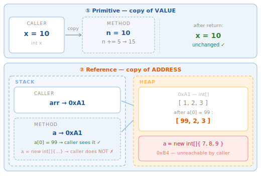
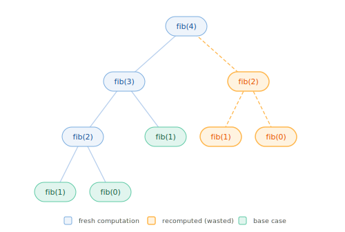

# Methods and Pass-by-value

## 1. What is it

A **method** is a named block of code that encapsulates a specific task and can be reused as many times as needed.

```java
public static int add(int a, int b) {
    return a + b;
}
```

- **`public`** — access modifier
- **`static`** — class-level, no object needed to call it
- **`int`** — return type
- **`add`** — method name (camelCase)
- **`(int a, int b)`** — parameter list (type + name per pair)
- Method body: `return` sends the result back to the caller.

Calling a method:

```java
int result = add(3, 5); // result = 8
```

---

## 2. Why it matters

Methods are the basic unit of **code organisation** in Java:

- **DRY** (Don't Repeat Yourself) — write logic once, call it anywhere
- **Testability** — small methods are easy to test in isolation
- **Readability** — a well-named method is self-documenting
- **Pass-by-value** is the foundational concept that explains why Java code behaves the way it does — a very common interview topic

---

## 3. Declaring a method

### Full syntax

```java
[access modifier] [static] [return type] methodName([parameters]) {
    // body
    [return value;]
}
```

### Return types

```java
// void — returns nothing
static void printHello() {
    System.out.println("Hello");
}

// Returns a value
static int square(int n) {
    return n * n;
}

// Early return — exits as soon as the result is known
static boolean isEven(int n) {
    return n % 2 == 0; // no if/else needed
}
```

!!! tip "One method, one job"
    If a method name needs the word "and" (e.g. `validateAndSave`), that is a sign it should be split into two separate methods.

### Every branch must return a value

```java
static int divide(int a, int b) {
    if (b != 0) return a / b;
    // ❌ compile error — no return here
}

static int divide(int a, int b) {
    if (b != 0) return a / b;
    return 0; // ✅ every branch has a return
}
```

---

## 4. Pass-by-value

**Java always passes arguments by value. No exceptions.**

This means: the method receives a **copy** of the value passed in — not the original variable itself.



### With primitives — copy of the value

```java
static void addFive(int n) {
    n += 5; // modifies the copy, not the original
}

int x = 10;
addFive(x);
System.out.println(x); // 10 — x is unchanged
```

### With objects / arrays — copy of the address

```java
static void changeFirst(int[] arr) {
    arr[0] = 99; // modifies the object's contents via the address — caller sees this
}

static void reassign(int[] arr) {
    arr = new int[]{7, 8, 9}; // modifies only the local variable — caller does NOT see this
}

int[] scores = {1, 2, 3};
changeFirst(scores);
System.out.println(scores[0]); // 99 — object content was changed

reassign(scores);
System.out.println(scores[0]); // still 99 — caller's variable was not changed
```

!!! warning "\"Pass-by-reference\" is the wrong term for Java"
    Java passes a **copy of the address**, not the variable itself. You can **mutate the object's contents** through the copied address, but you **cannot reassign the caller's variable**.

---

## 5. Method overloading

Same method name, different parameter list — Java picks the correct method at compile time based on argument types and count.

```java
static int    add(int a, int b)        { return a + b; }
static double add(double a, double b)  { return a + b; }
static int    add(int a, int b, int c) { return a + b + c; }

add(1, 2);     // calls add(int, int)
add(1.0, 2.5); // calls add(double, double)
add(1, 2, 3);  // calls add(int, int, int)
```

!!! warning "Return type does not differentiate overloads"
    ```java
    static int  getValue() { return 1; }
    static long getValue() { return 1L; } // ❌ compile error — ambiguous
    ```
    Java resolves overloads purely from the **parameter list**, not the return type.

---

## 6. Varargs — variable number of arguments

Allows passing any number of arguments — inside the method they are treated as an array.

```java
static int sum(int... numbers) { // numbers is int[]
    int total = 0;
    for (int n : numbers) total += n;
    return total;
}

sum();           // 0
sum(1);          // 1
sum(1, 2, 3);    // 6
sum(1, 2, 3, 4); // 10
```

```java
// Varargs must be the last parameter
static String format(String template, Object... args) {
    return String.format(template, args);
}
```

---

## 7. Static vs instance methods

```java
public class MathUtils {

    // Static — no object needed, called via the class name
    public static int abs(int n) {
        return n < 0 ? -n : n;
    }
}

int result = MathUtils.abs(-5); // 5
```

```java
public class Counter {
    private int count = 0; // instance field

    // Instance — needs an object, can access instance fields
    public void increment() { count++; }
    public int  getCount()  { return count; }
}

Counter c = new Counter();
c.increment();
c.increment();
System.out.println(c.getCount()); // 2
```

| | Static method | Instance method |
| --- | --- | --- |
| Called via | Class name | Object |
| Access instance fields | No | Yes |
| Use when | Utility, no state needed | Needs object state |

---

## 8. Recursion

A method that calls itself. Every recursive method needs two parts: a **base case** (stopping condition) and a **recursive case** (calls itself with a smaller problem).

```java
static int factorial(int n) {
    if (n <= 1) return 1;           // base case
    return n * factorial(n - 1);    // recursive case
}
```

### Call stack trace — factorial(4)

Each recursive call pushes a new **stack frame** onto the call stack. Once the base case is hit, frames are popped LIFO and results propagate back up:

```
factorial(4)           ← frame 0: n=4, waiting for factorial(3)
  factorial(3)         ← frame 1: n=3, waiting for factorial(2)
    factorial(2)       ← frame 2: n=2, waiting for factorial(1)
      factorial(1)     ← frame 3: n=1, base case → returns 1

      ← 1              pop frame 3
    ← 2 * 1 = 2        pop frame 2
  ← 3 * 2 = 6          pop frame 1
← 4 * 6 = 24           pop frame 0 → final result
```

### Fibonacci — the call tree

```java
static int fibonacci(int n) {
    if (n <= 1) return n;
    return fibonacci(n - 1) + fibonacci(n - 2); // each call spawns two branches
}
```

Each call splits into **two branches** — the tree grows exponentially. Orange nodes are recomputed unnecessarily:



`fib(30)` ≈ 1 million calls. Optimisation techniques (memoization, dynamic programming) are covered in Phase 2.

### Simple example — sum of digits

```java
// sumDigits(1234) = 4 + sumDigits(123) = 4 + 3 + sumDigits(12) = ... = 10
static int sumDigits(int n) {
    if (n < 10) return n;                 // base case: single digit
    return n % 10 + sumDigits(n / 10);   // last digit + rest
}
```

!!! tip "When to use recursion"
    Use recursion when the problem **naturally decomposes** into smaller sub-problems of the same shape: tree traversal, binary search, quicksort, mergesort. If a loop works — **use the loop**.

!!! warning "Recursion without a base case → StackOverflowError"
    Every method call pushes a new stack frame onto the call stack. The JVM defaults to roughly 500–1,000 nested frames. Deep recursion (n > 10,000) should use a loop instead.

---

## 9. Code example

```java linenums="1"
import java.util.Arrays;

public class MethodsDemo {

    // Overloading — find the maximum
    static int    max(int a, int b)       { return a > b ? a : b; }
    static double max(double a, double b) { return a > b ? a : b; }

    // Varargs — compute average
    static double average(double... nums) { // (1)
        if (nums.length == 0) return 0;
        double sum = 0;
        for (double n : nums) sum += n;
        return sum / nums.length;
    }

    // Pass-by-value: primitive
    static void tryDouble(int n) {
        n *= 2; // modifies only the copy
    }

    // Pass-by-value: reference — CAN modify the object's contents
    static void doubleAll(int[] arr) { // (2)
        for (int i = 0; i < arr.length; i++) arr[i] *= 2;
    }

    // Recursion
    static int gcd(int a, int b) { // (3)
        return b == 0 ? a : gcd(b, a % b);
    }

    // Early return instead of nested if
    static String classify(int score) {
        if (score >= 90) return "Excellent";
        if (score >= 75) return "Good";
        if (score >= 50) return "Average";
        return "Poor";
    }

    public static void main(String[] args) {
        System.out.println(max(3, 7));            // 7
        System.out.println(max(3.5, 2.8));        // 3.5
        System.out.println(average(80, 90, 70));  // 80.0

        int x = 10;
        tryDouble(x);
        System.out.println(x);                    // 10 — unchanged

        int[] arr = {1, 2, 3};
        doubleAll(arr);
        System.out.println(Arrays.toString(arr)); // [2, 4, 6] — modified

        System.out.println(gcd(48, 18));          // 6
        System.out.println(classify(85));         // Good
    }
}
```

1. Varargs `double... nums` — callable with any number of arguments including zero. Inside the method it is a plain `double[]`.
2. `doubleAll` receives a copy of the address of `arr`. Both copies point to the same array on the Heap — so changes through `arr[i]` are visible to the caller.
3. Euclid's algorithm for the greatest common divisor: clean recursion, easy to read, and runs in ~log(min(a,b)) steps.

---

## 10. Common mistakes

### Mistake 1 — Expecting a primitive to be modified by a method

```java
static void reset(int n) { n = 0; }

int count = 5;
reset(count);
System.out.println(count); // ❌ expects 0 but prints 5

// ✅ return the new value instead
static int reset() { return 0; }
count = reset();
```

### Mistake 2 — Expecting a reassigned reference to affect the caller

```java
static void clear(int[] arr) {
    arr = new int[arr.length]; // ❌ only changes the local variable
}

static void clear2(int[] arr) {
    Arrays.fill(arr, 0);       // ✅ modifies the object's contents
}
```

### Mistake 3 — Missing return in a branch

```java
static String grade(int score) {
    if (score >= 50) return "Pass";
    // ❌ compile error — what if score < 50?
}

static String grade(int score) {
    if (score >= 50) return "Pass";
    return "Fail"; // ✅
}
```

### Mistake 4 — Ambiguous overload

```java
static void process(int a, double b)    { }
static void process(double a, int b)    { }

process(1, 2); // ❌ ambiguous — compiler cannot choose
process(1, 2.0); // ✅ calls process(int, double)
```

### Mistake 5 — Recursion without a base case

```java
static int sum(int n) {
    return n + sum(n - 1); // ❌ never stops → StackOverflowError
}

static int sum(int n) {
    if (n <= 0) return 0;       // ✅ base case
    return n + sum(n - 1);
}
```

---

## 11. Interview questions

**Q1: Is Java pass-by-value or pass-by-reference?**

> Java is **always pass-by-value**. For primitives, the value is copied. For objects, the **address (reference)** is copied — so you can modify the object's contents inside a method, but you cannot reassign the caller's variable. Many people incorrectly call this "pass-by-reference."

**Q2: How does method overloading differ from method overriding?**

> **Overloading** — same name, different parameters, within the **same class**, resolved at **compile time**. **Overriding** — a subclass redefines a superclass method with the same signature, resolved at **runtime** (dynamic dispatch). Overriding is the foundation of Polymorphism, covered in the OOP phase.

**Q3: What is varargs? What are its limitations?**

> Varargs (`Type... name`) allows passing zero or more arguments of the same type — it is a plain array inside the method. Limitations: (1) only one varargs per method, (2) must be the last parameter, (3) indistinguishable from passing an array directly, (4) varargs overloads can easily become ambiguous.

**Q4: When should a method be static versus instance?**

> **Static** when the logic does not depend on object state — utility methods, factory methods, helper functions (e.g. `Math.abs()`, `Arrays.sort()`). **Instance** when the logic needs to read or modify a field of the object. If a method does not use any instance field, that is usually a sign it should be static.

**Q5: Why can recursion cause a `StackOverflowError`?**

> Each method call pushes a new **stack frame** onto the call stack — holding parameters, local variables, and the return address. The call stack has a fixed size limit (typically 512 KB–1 MB). Deep recursion with a missing or unreachable base case creates thousands of frames until the stack overflows. Solutions: convert to a loop, or simulate recursion with an explicit stack data structure.

---

## 12. References

| Resource | Content |
| --- | --- |
| [JLS §8.4 — Method Declarations](https://docs.oracle.com/javase/specs/jls/se21/html/jls-8.html#jls-8.4) | Official specification |
| [Oracle Tutorial — Methods](https://docs.oracle.com/javase/tutorial/java/javaOO/methods.html) | Official tutorial |
| [Oracle Tutorial — Passing Info to Methods](https://docs.oracle.com/javase/tutorial/java/javaOO/arguments.html) | Pass-by-value explained |
| *Clean Code* — Robert C. Martin | Chapter 3: Functions — small, do one thing, no side effects |
| *Effective Java* — Joshua Bloch | Item 53: Use varargs judiciously |
