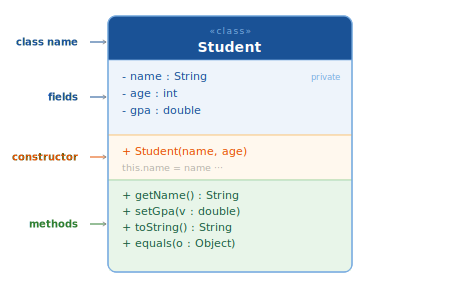
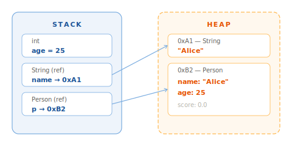

# OOP — Class and Object

## 1. What is it

A **class** is a blueprint that describes a type of entity: what data it holds (fields) and what it can do (methods).

An **object** is a concrete instance created from that class. One class can produce an unlimited number of objects.

```java
// Class — the blueprint
class Dog {
    String name;
    int age;

    void bark() {
        System.out.println(name + " says: Woof!");
    }
}

// Objects — concrete instances
Dog rex  = new Dog();
Dog luna = new Dog();
// rex and luna are two separate objects, both from class Dog
```

---

## 2. Why it matters

OOP is the foundation of Java and virtually every modern backend framework:

- **Spring Boot** is built around beans — objects managed by the Spring container
- **JPA/Hibernate** maps Java classes to database tables
- **Design patterns** (Factory, Strategy, Builder...) are all built on class hierarchies

Understanding class/object, static/instance, and the three methods `toString()` / `equals()` / `hashCode()` is the minimum requirement for working with any real Java codebase.

---

## 3. Class anatomy



### Fields — data

Fields (also called instance variables) store the state of each object.

```java
class Product {
    String name;
    double price;
    int    quantity;
}
```

Each object has its **own copy** of instance fields — changing a field on one object does not affect any other.

### Methods — behavior

Methods define what an object can do.

```java
class Product {
    String name;
    double price;
    int    quantity;

    double totalValue() {
        return price * quantity;
    }

    void restock(int amount) {
        quantity += amount;
    }
}
```

### Naming conventions

| Element | Convention | Example |
| --- | --- | --- |
| Class | PascalCase | `BankAccount`, `ProductService` |
| Field | camelCase | `firstName`, `accountBalance` |
| Method | camelCase, verb | `deposit()`, `calculateTax()` |
| Constant | UPPER\_SNAKE\_CASE | `MAX_RETRY`, `DEFAULT_TIMEOUT` |

---

## 4. Object creation — `new` and the Heap

### Creating an object

```java
Product p = new Product();
```

Three things happen in order:

1. **Heap allocation** — the JVM finds free space on the Heap and allocates memory for the object
2. **Default initialization** — fields are set to their zero values (`0`, `null`, `false`)
3. **Reference returned** — the address of the object on the Heap is stored in variable `p` on the Stack



### Default field values

| Type | Default |
| --- | --- |
| `int`, `long`, `short`, `byte` | `0` |
| `double`, `float` | `0.0` |
| `boolean` | `false` |
| `char` | `' '` |
| Object (`String`, array, ...) | `null` |

!!! warning "Local variables have no default"
    Object fields are automatically initialized. **Local variables** inside methods are not — reading one before assignment is a compile error.
    ```java
    int x;
    System.out.println(x); // ❌ compile error: variable x might not have been initialized
    ```

### Multiple references, one object

```java
Product a = new Product();
Product b = a;   // b points to the SAME object — not a copy

a.price = 100;
System.out.println(b.price); // 100 — same object
```

---

## 5. The `this` keyword

`this` is a reference to the object currently executing the method. It is required when a parameter name shadows a field of the same name.

```java
class Circle {
    double radius;

    void setRadius(double radius) {
        this.radius = radius; // this.radius = field; radius = parameter
    }

    double area() {
        return Math.PI * radius * radius; // this is optional here
    }
}
```

!!! tip "When is `this` required vs optional?"
    `this` is required when a parameter shadows a field. Otherwise it is optional — Java resolves `radius` to the field automatically when there is no local variable with the same name. Don't prefix every member access with `this`; it adds noise without clarity.

---

## 6. Static vs Instance

### Instance members

Belong to each **individual object**. Every object has its own copy.

```java
class Counter {
    int count = 0; // instance field — each object has its own

    void increment() { count++; }
}

Counter c1 = new Counter();
Counter c2 = new Counter();
c1.increment();
System.out.println(c1.count); // 1
System.out.println(c2.count); // 0 — unaffected
```

### Static members

Belong to the **class**, shared by all objects. Live in Metaspace.

```java
class Counter {
    static int totalCreated = 0; // shared, lives in Metaspace
    int count = 0;

    Counter() {
        totalCreated++; // every new object increments the shared counter
    }
}

Counter c1 = new Counter();
Counter c2 = new Counter();
System.out.println(Counter.totalCreated); // 2 — accessed via class name
```

### Static methods

No `this`. Cannot access instance fields directly.

```java
class MathUtils {
    static int square(int n) {
        return n * n; // no object needed
    }
}

int result = MathUtils.square(5); // called via class name
```

| | Instance | Static |
| --- | --- | --- |
| Belongs to | Object | Class |
| Memory | Heap (per object) | Metaspace (shared) |
| Called via | Object reference | Class name |
| Has `this` | Yes | No |
| Use when | Needs object state | Utility, no state needed |

!!! warning "Anti-pattern: calling static members via an object reference"
    ```java
    Counter c = new Counter();
    c.totalCreated;        // ❌ works but misleading — looks like an instance field
    Counter.totalCreated;  // ✅ clearly class-level data
    ```

---

## 7. `toString()`, `equals()`, `hashCode()`

These three methods are inherited from `Object` — the root class of every class in Java. The default implementations are rarely useful — most classes should override all three.

### `toString()`

Default returns `ClassName@hexHashCode` — meaningless to any reader.

```java
class Point {
    int x, y;

    Point(int x, int y) { this.x = x; this.y = y; }

    @Override
    public String toString() {
        return "Point(" + x + ", " + y + ")";
    }
}

Point p = new Point(3, 4);
System.out.println(p); // Point(3, 4) — Java calls toString() automatically
```

!!! tip "Override `toString()` for readable logs"
    `System.out.println(obj)`, string concatenation `"value: " + obj`, and loggers all call `toString()` automatically. Without an override, logs show `com.example.Point@7ef88735` — completely useless.

### `equals()`

Default compares **addresses** (same as `==`) — two distinct objects are always `false` even with identical data.

```java
class Point {
    int x, y;
    Point(int x, int y) { this.x = x; this.y = y; }

    @Override
    public boolean equals(Object o) {
        if (this == o) return true;                    // same address
        if (!(o instanceof Point other)) return false; // wrong type
        return x == other.x && y == other.y;           // compare data
    }
}

Point p1 = new Point(3, 4);
Point p2 = new Point(3, 4);
System.out.println(p1 == p2);      // false — different addresses
System.out.println(p1.equals(p2)); // true — same data
```

### `hashCode()`

**Contract:** if `a.equals(b)` is `true`, then `a.hashCode() == b.hashCode()` must also be `true`.

```java
class Point {
    int x, y;

    @Override
    public boolean equals(Object o) { /* ... */ }

    @Override
    public int hashCode() {
        return Objects.hash(x, y); // combines hashes of all fields used in equals()
    }
}
```

!!! note "Rule: override `equals()` → must override `hashCode()`"
    If you only override `equals()`: two equal objects can end up in different `HashMap` buckets — `HashSet.contains()` and `HashMap.get()` return wrong results with no exception or compile error. This is one of the most common silent bugs in Java.

### The fast path

IntelliJ: `Alt+Insert` → *Generate* → *equals() and hashCode()* generates correct code automatically.

Or use a **Record** (Java 16+) — `toString()`, `equals()`, and `hashCode()` are generated automatically:

```java
record Point(int x, int y) {} // nothing else needed

Point p1 = new Point(3, 4);
Point p2 = new Point(3, 4);
System.out.println(p1.equals(p2)); // true
System.out.println(p1);            // Point[x=3, y=4]
```

---

## 8. Code example

```java title="BankAccount.java" linenums="1"
import java.util.Objects;

public class BankAccount {

    private static int totalAccounts = 0; // (1)!

    private final String accountId;
    private final String owner;
    private double balance;

    public BankAccount(String owner, double initialBalance) {
        this.owner     = owner;
        this.balance   = initialBalance;
        this.accountId = "ACC-" + (++totalAccounts); // (2)!
    }

    public void deposit(double amount) {
        if (amount <= 0) return;
        balance += amount;
    }

    public boolean withdraw(double amount) {
        if (amount <= 0 || amount > balance) return false;
        balance -= amount;
        return true;
    }

    public double getBalance() { return balance; }

    public static int getTotalAccounts() { return totalAccounts; } // (3)!

    @Override
    public String toString() {
        return accountId + " [" + owner + "] $" + String.format("%.2f", balance);
    }

    @Override
    public boolean equals(Object o) {
        if (this == o) return true;
        if (!(o instanceof BankAccount other)) return false;
        return accountId.equals(other.accountId); // (4)!
    }

    @Override
    public int hashCode() {
        return Objects.hash(accountId);
    }

    public static void main(String[] args) {
        BankAccount alice = new BankAccount("Alice", 1000);
        BankAccount bob   = new BankAccount("Bob",   500);

        alice.deposit(200);
        bob.withdraw(100);

        System.out.println(alice);                          // ACC-1 [Alice] $1200.00
        System.out.println(bob);                            // ACC-2 [Bob] $400.00
        System.out.println(BankAccount.getTotalAccounts()); // 2

        BankAccount ref = alice;
        System.out.println(alice == ref);      // true — same address
        System.out.println(alice.equals(ref)); // true
        System.out.println(alice == bob);      // false
        System.out.println(alice.equals(bob)); // false — different accountId
    }
}
```

1. `static` — this field lives in Metaspace, shared across all instances. Incremented every time the constructor runs.
2. `accountId` is assigned from the already-incremented `totalAccounts` — each account gets a unique, auto-generated ID.
3. `static` method — called as `BankAccount.getTotalAccounts()`, no object required. Can only access static members.
4. Two `BankAccount` objects are equal if they share the same `accountId` — regardless of `balance` or `owner`.

---

## 9. Common mistakes

### Mistake 1 — Calling an instance method via the class name

```java
Dog.bark(); // ❌ compile error — bark() is an instance method, needs an object

Dog rex = new Dog();
rex.bark(); // ✅
```

### Mistake 2 — Forgetting `new`, using a null reference

```java
Product p;
p.price = 100; // ❌ NullPointerException — p points to nothing

Product p = new Product(); // ✅ create the object first
p.price = 100;
```

### Mistake 3 — Overriding `equals()` but forgetting `hashCode()`

```java
class User {
    String email;

    @Override
    public boolean equals(Object o) {
        if (!(o instanceof User u)) return false;
        return email.equals(u.email);
    }
    // ❌ missing hashCode()
}

Set<User> users = new HashSet<>();
users.add(new User("a@example.com"));
users.contains(new User("a@example.com")); // false — silent bug
```

```java
// ✅ always override both
@Override
public int hashCode() {
    return Objects.hash(email);
}
```

### Mistake 4 — Calling a static member via an object reference

```java
Counter c = new Counter();
int n = c.totalCreated;       // ❌ works but misleading
int n = Counter.totalCreated; // ✅ clearly class-level data
```

### Mistake 5 — Confusing multiple references with multiple objects

```java
Product a = new Product();
Product b = a; // b is NOT a copy — it points to the same object as a

b.price = 999;
System.out.println(a.price); // 999 — a and b are the same object
```

---

## 10. Interview questions

**Q1: What is the difference between a class and an object?**

> A **class** is a blueprint that defines structure and behavior — it exists at compile time and its metadata lives in Metaspace. An **object** is an instance created from that class at runtime — it lives on the Heap. One class can produce many objects; each object has its own copy of instance fields but shares the class metadata and method bytecode.

**Q2: What is the difference between `==` and `equals()`?**

> `==` compares **addresses** (reference equality) — it returns `true` only when both variables point to the exact same object on the Heap. `equals()` compares **content** (value equality) — its behavior is defined by overriding the method in the class. The default `equals()` from `Object` also compares addresses, so you must override it to get meaningful value comparison.

**Q3: Why must you override `hashCode()` when you override `equals()`?**

> Java's contract: two objects that are equal according to `equals()` must produce the same `hashCode()`. `HashMap` and `HashSet` use `hashCode()` to locate the bucket first, then use `equals()` to differentiate within it. Violating the contract — overriding `equals()` without `hashCode()` — can cause two equal objects to land in different buckets, making `HashSet.contains()` and `HashMap.get()` silently return wrong results with no exception.

**Q4: What is the `this` keyword used for?**

> `this` is a reference to the object currently executing the method. It is used to: (1) disambiguate a field from a parameter of the same name, (2) call another constructor in the same class via `this(...)`, (3) pass the current object as an argument. `this` cannot be used inside a static method because static methods are not bound to any instance.

**Q5: Where does JVM store static fields vs instance fields?**

> **Instance fields** live on the **Heap** — each object has its own copy, and they are garbage-collected when the object is no longer reachable. **Static fields** live in **Metaspace** (the Method Area) — shared by all instances of the class and alive for the entire lifetime of the class in the JVM.

---

## 11. References

| Resource | What to read |
| --- | --- |
| [JLS §8 — Class Declarations](https://docs.oracle.com/javase/specs/jls/se21/html/jls-8.html) | Official class specification |
| [Oracle Tutorial — Classes](https://docs.oracle.com/javase/tutorial/java/javaOO/classes.html) | Official tutorial |
| [JEP 395 — Records](https://openjdk.org/jeps/395) | Records — auto toString/equals/hashCode |
| *Effective Java* — Joshua Bloch | Item 10: equals(), Item 11: hashCode(), Item 12: toString() |
| *Head First Java* — Sierra & Bates | Chapter 2: A Trip to Objectville |
