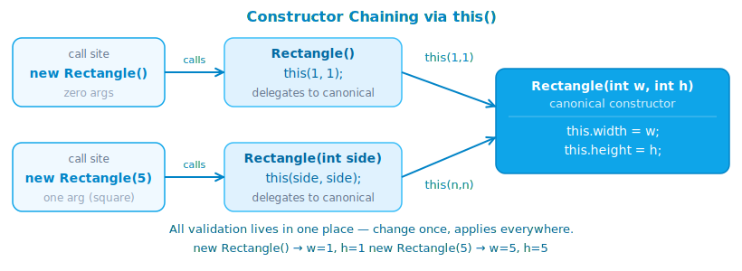

# Encapsulation and Constructor

## 1. What is it

**Encapsulation** is the principle of hiding an object's internal state, allowing access and modification only through a controlled interface.

A **constructor** is a special method that runs exactly once when an object is created with `new` — used to initialize fields to valid starting values.

```java
public class BankAccount {
    private double balance; // encapsulation: field is hidden

    public BankAccount(double initialBalance) { // constructor
        if (initialBalance < 0) throw new IllegalArgumentException("Balance cannot be negative");
        this.balance = initialBalance;
    }

    public double getBalance() { return balance; } // controlled access
}
```

---

## 2. Why it matters

Without encapsulation, any code can set a field to a nonsensical value:

```java
// No encapsulation
account.balance = -99999; // nothing prevents this

// With encapsulation
account.setBalance(-99999); // throws IllegalArgumentException — the object protects itself
```

Together, these two principles protect **object invariants** — the set of conditions that must always hold throughout the object's lifetime. For example: `balance >= 0`, `name != null`, `age > 0`.

Additionally:
- **Separates API from implementation** — change how data is stored internally without breaking callers
- **Easier to test** — validation logic is in one place, not scattered everywhere
- **Easier to debug** — object in a bad state? Only the setters and constructor need investigating

---

## 3. Access Modifiers

Access modifiers control who can access a field, method, or class.

| Modifier | Within class | Same package | Subclass | Everywhere |
| --- | :---: | :---: | :---: | :---: |
| `private` | ✓ | ✗ | ✗ | ✗ |
| _(default)_ | ✓ | ✓ | ✗ | ✗ |
| `protected` | ✓ | ✓ | ✓ | ✗ |
| `public` | ✓ | ✓ | ✓ | ✓ |

### Default rule

```java
public class Product {
    private String name;      // only within this class
    private double price;     // only within this class
    int quantity;             // default: same package (avoid in most cases)
    protected String sku;     // package + subclass (use when designing for inheritance)
    public static final int MAX_STOCK = 1000; // constant — public makes sense
}
```

!!! tip "Start with `private` and open up only when needed"
    For fields: always `private`. For methods: `private` unless they need to be called from outside. Widening access later is easy; narrowing it breaks existing callers.

!!! warning "`protected` does not mean 'safer than `public`'"
    `protected` is still accessible from any subclass — including subclasses in other packages. Don't treat it as semi-private. Only use `protected` when designing an inheritance hierarchy with clear intent.

---

## 4. Encapsulation — Getters and Setters

### Getters

Return the value of a private field.

```java
public class Person {
    private String  name;
    private int     age;
    private boolean active;

    public String  getName()   { return name; }   // get + FieldName
    public int     getAge()    { return age; }
    public boolean isActive()  { return active; }  // is + FieldName for booleans
}
```

!!! note "Getter naming convention"
    `getFieldName()` for all types. For `boolean`, use `isFieldName()`. Spring, JPA, and Jackson all rely on this convention to auto-bind and serialize objects — a wrong name is a silent bug.

### Setters

Allow modification of a field with validation.

```java
public class Person {
    private String name;
    private int    age;

    public void setName(String name) {
        if (name == null || name.isBlank())
            throw new IllegalArgumentException("Name must not be blank");
        this.name = name;
    }

    public void setAge(int age) {
        if (age < 0 || age > 150)
            throw new IllegalArgumentException("Age out of range: " + age);
        this.age = age;
    }
}
```

### When not to write setters

If a field should never change after construction — don't write a setter. Unnecessary setters invite bugs.

```java
public class Point {
    private final int x; // final — cannot be reassigned after construction
    private final int y;

    public Point(int x, int y) { this.x = x; this.y = y; }

    public int getX() { return x; }
    public int getY() { return y; }
    // no setX(), setY()
}
```

---

## 5. Constructor

### Syntax

```java
public class Temperature {
    private double celsius;

    // Constructor: same name as class, no return type
    public Temperature(double celsius) {
        this.celsius = celsius;
    }
}

Temperature t = new Temperature(100.0); // calls the constructor
```

### Default constructor

When no constructor is declared, Java automatically generates a **default no-arg constructor** that does nothing but call `super()`.

```java
class Empty {}

Empty e = new Empty(); // works — Java generated the constructor
```

!!! warning "Declaring any constructor removes the default"
    The moment you declare any constructor, Java **no longer** generates the default no-arg one.
    ```java
    class Box {
        int width;
        Box(int width) { this.width = width; }
    }

    Box b = new Box();    // ❌ compile error — no no-arg constructor
    Box b = new Box(10);  // ✅
    ```
    If you need both: declare the no-arg constructor explicitly.

### Initialization order

When `new` executes, three steps happen in sequence:

1. Heap allocation — JVM finds free space
2. Default values assigned to all fields (`0`, `null`, `false`)
3. Constructor body executes — overwrites the default values

```java
class Demo {
    int x;      // step 2: x = 0
    String s;   // step 2: s = null

    Demo() {
        x = 42;       // step 3: x = 42
        s = "hello";  // step 3: s = "hello"
    }
}
```

---

## 6. Constructor Overloading and `this()`

### Overloading

Multiple constructors with different parameter lists — Java picks the right one at the call site.

```java
public class Rectangle {
    private final int width;
    private final int height;

    public Rectangle(int width, int height) {
        this.width  = width;
        this.height = height;
    }

    public Rectangle(int side) {          // square
        this.width  = side;
        this.height = side;
    }

    public Rectangle() {                  // default 1×1
        this.width  = 1;
        this.height = 1;
    }
}

new Rectangle(4, 6); // w=4 h=6
new Rectangle(5);    // w=5 h=5
new Rectangle();     // w=1 h=1
```

### `this()` — constructor chaining

Calls another constructor in the same class. Must be the **first statement** in the constructor.

```java
public class Rectangle {
    private final int width;
    private final int height;

    public Rectangle(int width, int height) {
        this.width  = width;
        this.height = height;
    }

    public Rectangle(int side) {
        this(side, side);   // calls Rectangle(int, int) — no duplicated logic
    }

    public Rectangle() {
        this(1, 1);         // calls Rectangle(int, int)
    }
}
```



!!! tip "Use `this()` to avoid duplicating initialization logic"
    Instead of copy-pasting validation and assignment into every constructor, funnel all of them through the most complete one. When the logic changes, there is only one place to update.

---

## 7. Immutability with `final`

An **immutable** object cannot be changed after creation. The entire Java standard library is built on this pattern: `String`, `Integer`, `LocalDate`.

```java
public final class Money {             // final class — cannot be subclassed
    private final String currency;     // final field — assigned once in constructor
    private final long   amount;       // smallest unit (e.g. cents)

    public Money(String currency, long amount) {
        if (currency == null || currency.isBlank())
            throw new IllegalArgumentException("Currency required");
        if (amount < 0)
            throw new IllegalArgumentException("Amount cannot be negative");
        this.currency = currency;
        this.amount   = amount;
    }

    public String getCurrency() { return currency; }
    public long   getAmount()   { return amount; }

    // Instead of mutating, return a new object
    public Money add(Money other) {
        if (!this.currency.equals(other.currency))
            throw new IllegalArgumentException("Currency mismatch");
        return new Money(currency, this.amount + other.amount);
    }

    @Override public String toString() {
        return currency + " " + (amount / 100.0);
    }
}
```

Benefits of immutability:
- **Thread-safe by default** — no synchronization needed, no race conditions possible
- **Easier to reason about** — values never change unexpectedly
- **Safe to cache and share** — no caller can modify what another caller is using

!!! note "Record (Java 16+) is the fastest path to an immutable class"
    ```java
    record Money(String currency, long amount) {
        Money {  // compact constructor — runs validation
            if (currency == null || currency.isBlank())
                throw new IllegalArgumentException("Currency required");
            if (amount < 0)
                throw new IllegalArgumentException("Amount cannot be negative");
        }
    }
    ```
    Records automatically get `final` fields, field-named getters, `toString()`, `equals()`, and `hashCode()`.

---

## 8. Code example

```java title="UserAccount.java" linenums="1"
import java.util.Objects;

public final class UserAccount {

    private final String username;  // (1)!
    private String       email;
    private int          loginCount;
    private boolean      active;

    public UserAccount(String username, String email) { // (2)!
        this.username   = validateUsername(username);
        this.email      = validateEmail(email);
        this.loginCount = 0;
        this.active     = true;
    }

    private static String validateUsername(String username) {
        if (username == null || username.isBlank())
            throw new IllegalArgumentException("Username must not be blank");
        if (username.length() < 3)
            throw new IllegalArgumentException("Username too short: " + username);
        return username.toLowerCase().trim();
    }

    private static String validateEmail(String email) {
        if (email == null || !email.contains("@"))
            throw new IllegalArgumentException("Invalid email: " + email);
        return email.toLowerCase().trim();
    }

    public String  getUsername()   { return username; }
    public String  getEmail()      { return email; }
    public int     getLoginCount() { return loginCount; }
    public boolean isActive()      { return active; }

    public void setEmail(String email) {
        this.email = validateEmail(email); // (3)!
    }

    public void recordLogin() {
        if (!active) throw new IllegalStateException("Account is deactivated");
        loginCount++;
    }

    public void deactivate() {
        this.active = false;
    }

    @Override
    public String toString() {
        return "UserAccount{username='" + username + "', email='" + email
               + "', logins=" + loginCount + ", active=" + active + "}";
    }

    @Override
    public boolean equals(Object o) {
        if (this == o) return true;
        if (!(o instanceof UserAccount u)) return false;
        return username.equals(u.username); // (4)!
    }

    @Override
    public int hashCode() { return Objects.hash(username); }

    public static void main(String[] args) {
        UserAccount alice = new UserAccount("Alice_Dev", "alice@example.com");
        System.out.println(alice);               // UserAccount{username='alice_dev', ...}

        alice.recordLogin();
        alice.recordLogin();
        System.out.println(alice.getLoginCount()); // 2

        alice.setEmail("alice@newdomain.com");

        // alice.username = "hacker"; // ❌ compile error — private final

        alice.deactivate();
        try {
            alice.recordLogin();
        } catch (IllegalStateException e) {
            System.out.println(e.getMessage()); // Account is deactivated
        }
    }
}
```

1. `final` field — must be assigned in the constructor, cannot change afterwards. `username` is the account's identity and must never be modified.
2. Single constructor — no no-arg constructor. Every `UserAccount` must have a valid `username` and `email` from the start. There is no way to create a half-initialized object.
3. `setEmail` reuses `validateEmail` — validation logic is defined once. Changing the rule requires editing only one method.
4. Identity is based on `username` alone, not email or loginCount — two accounts with the same username represent the same user regardless of other fields.

---

## 9. Common mistakes

### Mistake 1 — Public fields, no encapsulation

```java
// ❌ any code can write directly to the field
public class Circle {
    public double radius;
}

Circle c = new Circle();
c.radius = -5; // meaningless, nothing stops this

// ✅
public class Circle {
    private double radius;
    public Circle(double radius) {
        if (radius <= 0) throw new IllegalArgumentException("Radius must be positive");
        this.radius = radius;
    }
    public double getRadius() { return radius; }
}
```

### Mistake 2 — Forgetting that declaring a constructor removes the default

```java
class Config {
    String host;
    int port;

    Config(String host, int port) {
        this.host = host;
        this.port = port;
    }
}

Config c = new Config(); // ❌ compile error — no no-arg constructor

// ✅ declare it explicitly if needed
Config() { this("localhost", 8080); }
```

### Mistake 3 — Getter returning a reference to a mutable object

```java
// ❌ caller can modify the internal list
public class Team {
    private List<String> members = new ArrayList<>();

    public List<String> getMembers() {
        return members; // dangerous — caller can call .clear() and wipe it out
    }
}

// ✅ return an unmodifiable view
public List<String> getMembers() {
    return Collections.unmodifiableList(members);
}
```

### Mistake 4 — `this()` is not the first statement

```java
public Rectangle(int side) {
    System.out.println("Creating square"); // ❌ compile error
    this(side, side); // this() must be the first line
}

// ✅
public Rectangle(int side) {
    this(side, side); // first line
}
```

### Mistake 5 — Setter with no validation, getter exposing internal state

```java
public void setAge(int age) {
    this.age = age; // ❌ age = -999 is accepted
}

public Date getBirthDate() {
    return birthDate; // ❌ Date is mutable — caller can modify it
}

// ✅
public void setAge(int age) {
    if (age < 0 || age > 150) throw new IllegalArgumentException("Invalid age: " + age);
    this.age = age;
}

public Date getBirthDate() {
    return new Date(birthDate.getTime()); // defensive copy
}
```

---

## 10. Interview questions

**Q1: What is encapsulation and why does it matter?**

> Encapsulation is the principle of hiding an object's implementation and only exposing what is necessary through a public interface. It matters because: (1) it protects object invariants — fields cannot be set to invalid values, (2) it separates API from implementation — internal changes don't break callers, (3) it centralizes validation in one place rather than scattering it across the codebase.

**Q2: What is the difference between `private`, `protected`, `default`, and `public`?**

> Access widens in that order: `private` (same class only) → `default`/package-private (same package) → `protected` (same package plus any subclass) → `public` (everywhere). Best practice: fields are always `private`, only widened when there is a clear reason.

**Q3: What is the default constructor? When does it disappear?**

> The default constructor is the no-arg constructor (`ClassName() {}`) that Java auto-generates when a class declares no constructors. It disappears the moment you declare any constructor — even a parameterized one. If you need both a parameterized constructor and a no-arg constructor, you must declare both explicitly.

**Q4: What is the difference between `this` and `this()`?**

> `this` is a reference to the current object — used to access instance fields and methods. `this()` is a call to another constructor in the same class — it must be the very first statement in the constructor and is used for constructor chaining to avoid duplicating initialization logic. They serve entirely different purposes.

**Q5: How do you make a class immutable?**

> Five requirements: (1) declare the class `final` to prevent subclasses from breaking immutability, (2) all fields are `private final`, (3) no setters, (4) the constructor validates all input and initializes all fields, (5) if a field holds a mutable object, return a defensive copy in the getter. The payoff: immutable objects are thread-safe without synchronization.

**Q6: Why is returning a mutable `List` from a getter dangerous?**

> Because the caller can invoke `.add()`, `.remove()`, or `.clear()` directly on the object's internal list — breaking encapsulation completely without going through any setter. The fix is to return `Collections.unmodifiableList(list)` or `List.copyOf(list)` so callers can read but not modify.

---

## 11. References

| Resource | What to read |
| --- | --- |
| [Oracle Tutorial — Controlling Access](https://docs.oracle.com/javase/tutorial/java/javaOO/accesscontrol.html) | Official access modifier guide |
| [JEP 395 — Records](https://openjdk.org/jeps/395) | Fastest path to immutable classes |
| *Effective Java* — Joshua Bloch | Item 15: Minimize mutability · Item 16: Favor composition · Item 17: Design for inheritance |
| *Clean Code* — Robert C. Martin | Chapter 6: Objects and Data Structures — Law of Demeter |
