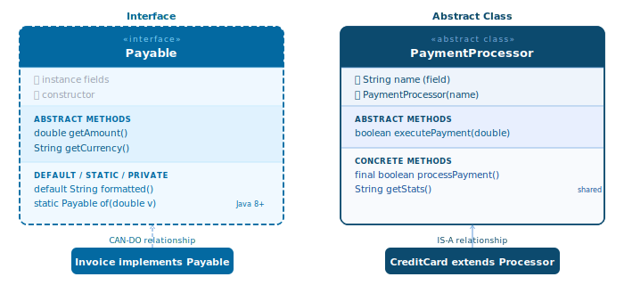

# Interface

## 1. What is an Interface

An **interface** is a "contract" — it defines *what* a class must do without caring *how* it does it. Any class that commits to implementing an interface must provide implementations for all the methods the interface requires.

```java
public interface Drawable {
    void draw(); // abstract method — no body
}

public class Circle implements Drawable {
    @Override
    public void draw() {
        System.out.println("Drawing a circle");
    }
}

public class Square implements Drawable {
    @Override
    public void draw() {
        System.out.println("Drawing a square");
    }
}
```

```java
Drawable d = new Circle();
d.draw(); // Drawing a circle

d = new Square();
d.draw(); // Drawing a square
```

The code calling `d.draw()` doesn't need to know whether `d` is a `Circle` or a `Square` — it only needs to know `d` is `Drawable`. This is **loose coupling** — the core strength of interfaces.

---

## 2. Why It Matters

Interfaces are the foundation of many patterns and features in Java:

- **Polymorphism** — one variable can point to many different types of objects
- **Loose coupling** — code depends on abstractions, not on concrete implementations
- **Dependency Injection** — Spring Boot injects implementations based on interfaces (Phase 05)
- **Testing** — easy to mock interfaces for isolated unit tests
- **Multiple behavior** — a class can implement many interfaces (Java doesn't allow extending multiple classes)

Most of the JDK is built on interfaces: `List`, `Map`, `Set`, `Comparable`, `Runnable`, `Iterable`...

---

## 3. Declaring an Interface

```java
public interface Flyable {
    // Constant — implicitly public static final
    double MAX_ALTITUDE = 12_000; // equivalent to: public static final double MAX_ALTITUDE = 12_000;

    // Abstract method — implicitly public abstract
    void fly();                   // equivalent to: public abstract void fly();
    void land(String location);
}
```

!!! tip "Interface naming convention"
    Interfaces are typically named after an ability: `Runnable`, `Comparable`, `Serializable`, `Drawable`, `Flyable`. This distinguishes them from classes (nouns: `Dog`, `Circle`). Some JDK interfaces use noun names: `List`, `Map`, `Collection`.

---

## 4. Implementing an Interface

```java
public class Airplane implements Flyable {

    @Override
    public void fly() {
        System.out.println("Airplane takes off");
    }

    @Override
    public void land(String location) {
        System.out.println("Landing at " + location);
    }
}
```

A class **must implement all abstract methods** of the interface — any missing method is a compile error.

---

## 5. Multiple Interfaces — the Biggest Advantage

A class can only `extend` **one** superclass, but it can `implement` **multiple** interfaces:

```java
public interface Swimable {
    void swim();
}

public interface Flyable {
    void fly();
}

public interface Runnable {
    void run();
}

// Duck can do all three
public class Duck implements Flyable, Swimable, Runnable {

    @Override public void fly()  { System.out.println("Duck flies"); }
    @Override public void swim() { System.out.println("Duck swims"); }
    @Override public void run()  { System.out.println("Duck runs"); }
}
```

```java
Duck duck = new Duck();

Flyable  f = duck; f.fly();  // Duck flies
Swimable s = duck; s.swim(); // Duck swims
Runnable r = duck; r.run();  // Duck runs
```

This lets a single object be viewed from different "angles" depending on context — not possible with `extends`.

---

## 6. Default Methods (Java 8+)

Before Java 8, interfaces could only have abstract methods. Since Java 8, interfaces can have **default methods** — methods with a body that implementing classes can use directly or override.

```java
public interface Greeting {
    String getName();

    // Default method — has a body, ready to use
    default String greet() {
        return "Hello, " + getName() + "!";
    }

    default String greetFormal() {
        return "Good day, " + getName() + ". Pleased to meet you.";
    }
}

public class User implements Greeting {
    private String name;

    User(String name) { this.name = name; }

    @Override
    public String getName() { return name; }

    // greet() and greetFormal() are inherited — no override needed
}

public class VIPUser implements Greeting {
    private String name;

    VIPUser(String name) { this.name = name; }

    @Override
    public String getName() { return name; }

    @Override
    public String greet() { // override when different behavior is needed
        return "✨ Special greeting, " + getName() + "!";
    }
}
```

```java
User    u = new User("Alice");
VIPUser v = new VIPUser("Bob");

System.out.println(u.greet());       // Hello, Alice!
System.out.println(u.greetFormal()); // Good day, Alice. Pleased to meet you.
System.out.println(v.greet());       // ✨ Special greeting, Bob!
```

!!! tip "Why default methods?"
    Default methods solve the **backward compatibility** problem: adding an abstract method to an existing interface would break every class that already implements it. Default methods let you add new methods to an interface without breaking old code. Examples: `List.sort()`, `Map.getOrDefault()` were added in Java 8 via default methods.

---

## 7. Static Methods in Interfaces (Java 8+)

Interfaces can have static methods — utility methods related to the interface, not tied to any instance.

```java
public interface MathUtils {
    static int clamp(int value, int min, int max) {
        return Math.max(min, Math.min(max, value));
    }
}
```

```java
System.out.println(MathUtils.clamp(150, 0, 100)); // 100
System.out.println(MathUtils.clamp(-5,  0, 100)); // 0
```

---

## 8. Private Methods in Interfaces (Java 9+)

Interfaces can have private methods — used to share code between default methods without exposing them externally.

```java
public interface Logger {

    default void logInfo(String msg) {
        log("INFO", msg);
    }

    default void logError(String msg) {
        log("ERROR", msg);
    }

    // Private — only visible within this interface, not to implementing classes
    private void log(String level, String msg) {
        System.out.printf("[%s] %s%n", level, msg);
    }
}
```

---

## 9. Interface vs Abstract Class



| | Interface | Abstract Class |
|---|---|---|
| Keyword | `implements` | `extends` |
| How many | Multiple interfaces | Only one class |
| Constructor | No | Yes |
| Fields | `public static final` only | Any kind |
| Methods | abstract, default, static, private | Any kind |
| Instance state | None | Yes |
| Use when | Defining **capabilities** (can-do) | Sharing **common code** + **is-a** |

**Decision rule:**

```
Need to share code (fields, constructors, concrete methods)?
    → Abstract Class

Need multiple "sources" of behavior? Or defining a capability, not an identity?
    → Interface

Not sure?
    → Interface — more flexible, fewer constraints
```

---

## 10. Important JDK Interfaces

### Comparable\<T\> — natural ordering

```java
public class Student implements Comparable<Student> {
    String name;
    double gpa;

    Student(String name, double gpa) {
        this.name = name;
        this.gpa  = gpa;
    }

    @Override
    public int compareTo(Student other) {
        return Double.compare(other.gpa, this.gpa); // sort descending by GPA
    }
}
```

```java
List<Student> list = new ArrayList<>();
list.add(new Student("Alice", 8.5));
list.add(new Student("Bob",   9.2));
list.add(new Student("Carol", 7.8));

Collections.sort(list); // uses compareTo()
list.forEach(s -> System.out.println(s.name + ": " + s.gpa));
// Bob:   9.2
// Alice: 8.5
// Carol: 7.8
```

### Iterable\<T\> — for-each support

```java
public class NumberRange implements Iterable<Integer> {
    private final int start, end;

    NumberRange(int start, int end) {
        this.start = start;
        this.end   = end;
    }

    @Override
    public java.util.Iterator<Integer> iterator() {
        return new java.util.Iterator<>() {
            int current = start;

            @Override public boolean hasNext() { return current <= end; }
            @Override public Integer next()    { return current++; }
        };
    }
}
```

```java
for (int n : new NumberRange(1, 5)) {
    System.out.print(n + " "); // 1 2 3 4 5
}
```

### AutoCloseable — try-with-resources

```java
public class DatabaseConnection implements AutoCloseable {
    DatabaseConnection() { System.out.println("Opening DB connection"); }

    public void query(String sql) { System.out.println("Query: " + sql); }

    @Override
    public void close() { System.out.println("Closing DB connection"); }
}
```

```java
try (DatabaseConnection conn = new DatabaseConnection()) {
    conn.query("SELECT * FROM users");
} // close() called automatically
// Output:
// Opening DB connection
// Query: SELECT * FROM users
// Closing DB connection
```

---

## 11. Functional Interface — Brief Introduction

A **functional interface** has exactly **one abstract method**. It is the foundation for Lambda expressions (covered in depth in Phase 02).

```java
@FunctionalInterface // optional annotation — compiler enforces the single-abstract-method rule
public interface Calculator {
    int calculate(int a, int b);
}
```

```java
// Traditional — anonymous class
Calculator add = new Calculator() {
    @Override
    public int calculate(int a, int b) { return a + b; }
};

// Modern — Lambda (Phase 02)
Calculator add = (a, b) -> a + b;
Calculator mul = (a, b) -> a * b;

System.out.println(add.calculate(3, 4)); // 7
System.out.println(mul.calculate(3, 4)); // 12
```

Built-in functional interfaces in the JDK: `Runnable`, `Callable`, `Comparator`, `Predicate<T>`, `Function<T,R>`, `Consumer<T>`, `Supplier<T>` — covered in detail in Phase 02 alongside the Stream API.

---

## 12. Full Example

!!! info "Verified"
    Full compilable source: [`InterfaceDemo.java`](https://github.com/minhdao-dev/java-docs/blob/main/examples/src/main/java/fundamentals/interfaces/InterfaceDemo.java)

```java linenums="1"
import java.util.ArrayList;
import java.util.Collections;
import java.util.List;

public class InterfaceDemo {

    // Interface — contract
    interface Shape {
        double area();
        double perimeter();

        default String describe() { // (1)
            return "%s | Area: %.2f | Perimeter: %.2f"
                .formatted(getClass().getSimpleName(), area(), perimeter());
        }
    }

    interface Resizable {
        void resize(double factor);
    }

    // Implements 2 interfaces
    static class Circle implements Shape, Resizable {
        private double radius;

        Circle(double radius) { this.radius = radius; }

        @Override public double area()      { return Math.PI * radius * radius; }
        @Override public double perimeter() { return 2 * Math.PI * radius; }
        @Override public void resize(double factor) { radius *= factor; }
    }

    static class Rectangle implements Shape, Comparable<Rectangle> {
        private double w, h;

        Rectangle(double w, double h) { this.w = w; this.h = h; }

        @Override public double area()      { return w * h; }
        @Override public double perimeter() { return 2 * (w + h); }

        @Override
        public int compareTo(Rectangle other) { // (2)
            return Double.compare(this.area(), other.area());
        }
    }

    public static void main(String[] args) {
        // Polymorphism through interface
        List<Shape> shapes = new ArrayList<>();
        shapes.add(new Circle(5));
        shapes.add(new Rectangle(4, 6));
        shapes.add(new Circle(3));

        for (Shape s : shapes) {
            System.out.println(s.describe()); // same method call, different behavior
        }

        System.out.println();

        // Resize — only Circle implements Resizable
        Circle c = new Circle(5);
        System.out.println("Before: " + c.describe());
        c.resize(2.0);
        System.out.println("After:  " + c.describe());

        System.out.println();

        // Sort Rectangle by area — using Comparable
        List<Rectangle> rects = List.of(
            new Rectangle(3, 4),
            new Rectangle(1, 2),
            new Rectangle(5, 6)
        );
        List<Rectangle> sorted = new ArrayList<>(rects);
        Collections.sort(sorted);
        sorted.forEach(r -> System.out.printf("%.0fx%.0f = %.0f%n", r.w, r.h, r.area()));
    }
}
```

1. The default method `describe()` is defined once in the interface and inherited by all implementing classes (`Circle`, `Rectangle`) with no override needed — this is the power of default methods.
2. `Rectangle implements Comparable<Rectangle>` enables `Collections.sort()` without passing a separate `Comparator` — Java knows how to compare two `Rectangle` instances via `compareTo()`.

**Output:**
```
Circle | Area: 78.54 | Perimeter: 31.42
Rectangle | Area: 24.00 | Perimeter: 20.00
Circle | Area: 28.27 | Perimeter: 18.85

Before: Circle | Area: 78.54 | Perimeter: 31.42
After:  Circle | Area: 314.16 | Perimeter: 62.83

1x2 = 2
3x4 = 12
5x6 = 30
```

---

## 13. Common Mistakes

### Mistake 1 — Forgetting to implement a method

```java
interface Animal {
    void eat();
    void sleep();
}

// ❌ compile error: Dog hasn't implemented sleep()
class Dog implements Animal {
    @Override public void eat() { System.out.println("Dog eats"); }
    // sleep() forgotten — compiler catches it immediately
}

// ✅ Implement all methods
class Dog implements Animal {
    @Override public void eat()   { System.out.println("Dog eats"); }
    @Override public void sleep() { System.out.println("Dog sleeps"); }
}
```

### Mistake 2 — Conflict when two interfaces share a default method name

```java
interface A { default void hello() { System.out.println("A"); } }
interface B { default void hello() { System.out.println("B"); } }

// ❌ compile error: class must specify which default method to use
class C implements A, B { }

// ✅ Override and specify explicitly
class C implements A, B {
    @Override
    public void hello() {
        A.super.hello(); // call A's default method
    }
}
```

### Mistake 3 — Expecting instance state in an interface

```java
// ❌ Interface fields are implicitly public static final — not instance fields
interface Counter {
    int count = 0;      // this is a constant shared by all, NOT per-instance state
    void increment();
}

// ✅ State belongs in the implementing class
class SimpleCounter implements Counter {
    private int count = 0; // instance field in the class

    @Override
    public void increment() { count++; }

    public int getCount() { return count; }
}
```

### Mistake 4 — Using interface when you need a constructor or shared state

```java
// ❌ Interfaces have no constructors — can't share initialization logic
interface Vehicle {
    // Can't write: Vehicle(String brand) { this.brand = brand; }
}

// ✅ Use an abstract class when you need a constructor or shared instance fields
abstract class Vehicle {
    protected final String brand;

    Vehicle(String brand) { this.brand = brand; }

    abstract void start();
}
```

---

## 14. Interview Questions

**Q1: What is the difference between Interface and Abstract Class? When do you choose each?**

> **Interface** defines *capabilities* (can-do) — a class can implement many interfaces, no constructor, no instance state, fields are implicitly `public static final`. **Abstract class** shares *code and state* between subclasses — has constructors, instance fields, and concrete methods, but can only be extended once. **Choose interface** when defining a contract or behavior that multiple unrelated classes should share. **Choose abstract class** when there is genuinely shared code or state to reuse and the subclasses have a clear is-a relationship.

**Q2: What problem do default methods solve?**

> Default methods (Java 8+) solve **backward compatibility**: before Java 8, adding an abstract method to an existing interface would break every class that implemented it. Default methods let you add new behavior to an interface without breaking any existing implementations — old classes inherit the default, new classes can override it. Examples: `List.sort()`, `Map.forEach()` were added to Java 8 this way.

**Q3: What is a functional interface and why does it matter?**

> A functional interface has exactly **one abstract method** (it may have multiple default or static methods). It is the foundation for **Lambda expressions** — instead of anonymous class boilerplate, behavior can be passed as a concise expression. The `@FunctionalInterface` annotation is optional but lets the compiler enforce the constraint. Examples: `Runnable`, `Comparator`, `Predicate`, `Function` are all functional interfaces.

**Q4: If two interfaces have a default method with the same name, what must the implementing class do?**

> The class must **override the method** and explicitly specify which interface's default to use via `InterfaceName.super.methodName()`. Without the override, the compiler raises an error because the ambiguity must be resolved explicitly. This is the "explicit wins" rule — conflicts must be resolved in code, not left to chance.

**Q5: Why does Spring Boot inject interfaces instead of concrete classes?**

> This follows the **Dependency Inversion principle** (the D in SOLID): code should depend on abstractions, not on concrete implementations. When Spring injects `UserService` (interface) rather than `UserServiceImpl` (class), the calling code is not locked into one implementation — easy to swap implementations, easy to mock in tests, open to extension without modifying existing code. This is also why Spring AOP (transactions, security, caching) works: Spring creates a proxy that implements the same interface and wraps around the real implementation transparently.

---

## 15. References

| Resource | Content |
|----------|---------|
| [JLS §9 — Interfaces](https://docs.oracle.com/javase/specs/jls/se21/html/jls-9.html) | Official specification |
| [Oracle Tutorial — Interfaces](https://docs.oracle.com/javase/tutorial/java/IandI/createinterface.html) | Official guide |
| [Baeldung — Java Interface](https://www.baeldung.com/java-interfaces) | Practical walkthrough |
| *Effective Java* — Joshua Bloch | Item 20: Prefer interfaces to abstract classes · Item 21: Design interfaces for posterity |
