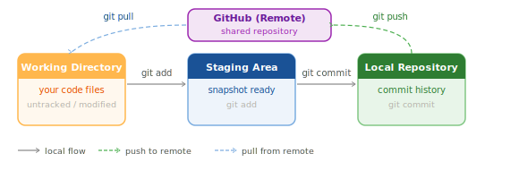

# Git và GitHub

## 1. Git là gì — tại sao cần thiết

**Git** là hệ thống quản lý phiên bản (version control system). Nó ghi lại lịch sử mọi thay đổi bạn thực hiện trên code, cho phép:

- **Quay lại phiên bản cũ** khi code bị hỏng
- **Làm việc song song** trên nhiều tính năng mà không ảnh hưởng nhau (branch)
- **Hợp tác nhóm** — nhiều người cùng làm trên một dự án

**GitHub** là dịch vụ lưu trữ Git repository trên đám mây. Code trên máy bạn là *local*, GitHub là *remote* — bản sao lưu trên internet.

!!! tip "Git ≠ GitHub"
    Git là công cụ chạy trên máy bạn. GitHub là website lưu trữ code. Bạn dùng Git để quản lý code, dùng GitHub để chia sẻ và sao lưu.

---

## 2. Luồng làm việc với Git



| Khu vực | Vai trò |
|---------|---------|
| **Working Directory** | Nơi bạn viết và sửa code |
| **Staging Area** | "Giỏ hàng" — chọn những thay đổi nào sẽ vào commit |
| **Local Repository** | Lịch sử commit trên máy bạn (thư mục `.git`) |
| **Remote (GitHub)** | Bản sao lưu trên internet |

---

## 3. Cài đặt Git

=== "Windows"

    ### Tải Git

    1. Vào [https://git-scm.com/download/win](https://git-scm.com/download/win) — trang tự động phát hiện Windows và đề xuất bản tải đúng.
    2. Tải file `.exe` (khoảng 60 MB).

    ### Cài đặt

    1. Chạy file `.exe`, nhấn **Yes** để cho phép thay đổi máy tính.
    2. Màn hình chọn components — giữ mặc định, nhấn **Next** liên tục.
    3. Màn hình **Choosing the default editor** — chọn **Notepad** hoặc **Nano** nếu bạn chưa quen với Vim, sau đó **Next**.
    4. Màn hình **Adjusting your PATH** — chọn **Git from the command line and also from 3rd-party software** (tùy chọn giữa) — **rất quan trọng**.
    5. Các màn hình còn lại — giữ mặc định, nhấn **Next** đến khi **Install**, rồi **Finish**.

    ### Kiểm tra

    Mở Command Prompt hoặc PowerShell mới:

    ```cmd
    git --version
    ```

    Kết quả ví dụ: `git version 2.47.0.windows.1`

=== "macOS"

    ### Cách 1 — Xcode Command Line Tools (đơn giản nhất)

    Mở Terminal và chạy:

    ```bash
    git --version
    ```

    Nếu Git chưa có, macOS tự động hỏi có muốn cài Xcode Command Line Tools không — nhấn **Install**. Quá trình mất 5–10 phút.

    ### Cách 2 — Homebrew

    ```bash
    brew install git
    ```

    Phiên bản qua Homebrew mới hơn phiên bản của Apple.

=== "Linux"

    ```bash
    # Ubuntu / Debian
    sudo apt update && sudo apt install -y git

    # Fedora
    sudo dnf install -y git

    # Arch
    sudo pacman -S git
    ```

    Kiểm tra: `git --version`

---

## 4. Cấu hình Git lần đầu

Trước khi dùng Git, cần đặt tên và email. Thông tin này gắn vào mọi commit bạn tạo.

```bash
git config --global user.name "Ten Cua Ban"
git config --global user.email "email@example.com"
```

Thay `"Ten Cua Ban"` và `"email@example.com"` bằng tên và email thật của bạn (nên dùng email giống với tài khoản GitHub).

Kiểm tra cấu hình:

```bash
git config --list
```

!!! note "Chỉ cần làm một lần"
    Lệnh `--global` lưu vào file `~/.gitconfig` và áp dụng cho tất cả repository trên máy. Bạn chỉ cần chạy hai lệnh này một lần duy nhất.

---

## 5. Tạo tài khoản GitHub

1. Vào [https://github.com](https://github.com), nhấn **Sign up**.
2. Nhập địa chỉ email, tạo mật khẩu, chọn username.
3. Xác nhận email bằng cách nhấn vào link trong email GitHub gửi về.
4. Chọn gói **Free** (đủ cho mọi nhu cầu học tập).

---

## 6. Tạo repository đầu tiên trên GitHub

1. Đăng nhập GitHub, nhấn nút **+** ở góc trên phải → **New repository**.
2. Điền thông tin:
    - **Repository name:** `java-practice` (hoặc tên bạn muốn)
    - **Description:** tùy chọn
    - **Public** / **Private:** chọn Public nếu muốn chia sẻ, Private nếu chỉ mình bạn thấy
    - ✅ Tick **Add a README file**
3. Nhấn **Create repository**.

GitHub đưa bạn vào trang repository vừa tạo, hiển thị URL dạng `https://github.com/username/java-practice`.

---

## 7. Kết nối máy tính với GitHub — SSH Key

Git cần xác thực danh tính trước khi cho phép đẩy code lên GitHub. Cách an toàn và thuận tiện nhất là dùng **SSH key**.

### Bước 1 — Kiểm tra SSH key cũ

```bash
ls ~/.ssh
```

Nếu thấy file `id_ed25519` và `id_ed25519.pub` — bạn đã có SSH key, bỏ qua Bước 2.

### Bước 2 — Tạo SSH key mới

```bash
ssh-keygen -t ed25519 -C "email@example.com"
```

Thay `email@example.com` bằng email GitHub của bạn.

Khi được hỏi:
- `Enter file in which to save the key` — nhấn **Enter** để dùng vị trí mặc định.
- `Enter passphrase` — có thể để trống (nhấn **Enter** hai lần) hoặc đặt mật khẩu bảo vệ.

### Bước 3 — Thêm SSH key vào GitHub

Sao chép nội dung public key:

=== "macOS"

    ```bash
    cat ~/.ssh/id_ed25519.pub
    ```

=== "Windows (PowerShell)"

    ```powershell
    Get-Content "$env:USERPROFILE\.ssh\id_ed25519.pub"
    ```

=== "Linux"

    ```bash
    cat ~/.ssh/id_ed25519.pub
    ```

Sao chép toàn bộ dòng text bắt đầu bằng `ssh-ed25519 ...`.

Trên GitHub:
1. Nhấn ảnh đại diện → **Settings** → **SSH and GPG keys**.
2. Nhấn **New SSH key**.
3. **Title:** đặt tên để nhận ra máy tính (ví dụ `Laptop cá nhân`).
4. **Key:** dán nội dung vừa sao chép vào.
5. Nhấn **Add SSH key**.

### Bước 4 — Kiểm tra kết nối

```bash
ssh -T git@github.com
```

Kết quả thành công:

```
Hi username! You've successfully authenticated, but GitHub does not provide shell access.
```

---

## 8. Clone repository về máy

```bash
git clone git@github.com:username/java-practice.git
```

Thay `username` bằng GitHub username của bạn. Lệnh này tạo thư mục `java-practice` chứa toàn bộ repository.

```bash
cd java-practice
```

---

## 9. Vòng lặp làm việc hàng ngày với Git

Đây là quy trình bạn sẽ lặp lại mỗi ngày:

### Bước 1 — Kiểm tra trạng thái hiện tại

```bash
git status
```

Lệnh này hiển thị:
- File nào đã thay đổi (modified)
- File nào đang ở staging (staged)
- File nào chưa được track (untracked)

### Bước 2 — Thêm thay đổi vào staging

```bash
git add TenFile.java          # thêm một file cụ thể
git add .                     # thêm tất cả thay đổi trong thư mục hiện tại
```

!!! tip "Nên dùng `git add` theo file cụ thể"
    `git add .` tiện lợi nhưng có thể thêm file không mong muốn. Khi mới học, hãy chỉ định rõ tên file.

### Bước 3 — Tạo commit

```bash
git commit -m "Mô tả ngắn gọn về thay đổi"
```

Ví dụ:

```bash
git commit -m "Add BankAccount class with deposit and withdraw methods"
```

!!! tip "Viết commit message tốt"
    - Bắt đầu bằng động từ: `Add`, `Fix`, `Update`, `Remove`
    - Ngắn gọn, rõ ràng — người khác đọc commit message phải hiểu bạn làm gì
    - Tiếng Anh là chuẩn quốc tế, nhưng dùng tiếng Việt cũng không sao khi làm một mình

### Bước 4 — Đẩy code lên GitHub

```bash
git push origin main
```

### Bước 5 — Kéo code mới nhất từ GitHub (khi làm nhóm hoặc dùng nhiều máy)

```bash
git pull origin main
```

---

## 10. Ví dụ hoàn chỉnh — từ đầu đến cuối

```bash
# Clone repository về máy
git clone git@github.com:username/java-practice.git
cd java-practice

# Tạo file Java mới
# ... (viết code trong IDE hoặc text editor) ...

# Kiểm tra trạng thái
git status

# Thêm file vào staging
git add HelloWorld.java

# Tạo commit
git commit -m "Add HelloWorld program"

# Đẩy lên GitHub
git push origin main
```

---

## 11. File .gitignore — không track file không cần thiết

File `.gitignore` liệt kê các file/thư mục Git sẽ bỏ qua hoàn toàn.

Tạo file `.gitignore` trong thư mục gốc của project:

```gitignore
# Bytecode
*.class

# Build output
target/
out/

# IDE files
.idea/
*.iml
.vscode/
.classpath
.project
.settings/

# macOS
.DS_Store

# Windows
Thumbs.db
```

!!! note "Tạo .gitignore tự động"
    Trang [gitignore.io](https://www.toptal.com/developers/gitignore) cho phép chọn ngôn ngữ và IDE, tự động tạo nội dung `.gitignore` phù hợp. Ví dụ: chọn `Java`, `IntelliJ`, `macOS`.

---

## 12. Các lệnh Git cần nhớ

| Lệnh | Tác dụng |
|------|----------|
| `git init` | Khởi tạo Git repository mới trong thư mục hiện tại |
| `git clone <url>` | Sao chép repository từ remote về máy |
| `git status` | Xem trạng thái working directory và staging |
| `git add <file>` | Thêm file vào staging |
| `git add .` | Thêm tất cả thay đổi vào staging |
| `git commit -m "msg"` | Tạo commit với message |
| `git push origin main` | Đẩy commit lên remote branch `main` |
| `git pull origin main` | Kéo code mới nhất từ remote |
| `git log` | Xem lịch sử commit |
| `git log --oneline` | Lịch sử commit ngắn gọn |
| `git diff` | Xem thay đổi chưa được stage |

---

## 13. Xử lý lỗi thường gặp

### `Permission denied (publickey)`

**Nguyên nhân:** SSH key chưa được thêm vào GitHub, hoặc chưa được load vào SSH agent.

**Cách sửa:**

```bash
eval "$(ssh-agent -s)"
ssh-add ~/.ssh/id_ed25519
ssh -T git@github.com   # kiểm tra lại
```

### `error: failed to push some refs`

**Nguyên nhân:** Remote có commit mà local chưa có (ai đó đã push trước bạn).

**Cách sửa:**

```bash
git pull origin main    # kéo về trước
# giải quyết conflict nếu có
git push origin main    # push lại
```

### `fatal: not a git repository`

**Nguyên nhân:** Bạn đang chạy lệnh Git ngoài thư mục có repository.

**Cách sửa:** Dùng `cd` để vào đúng thư mục chứa `.git`, hoặc chạy `git init` để tạo repository mới.

---

Tiếp theo: [Maven và Hello World](05-maven-hello-world.md) — tạo project Java chuẩn với build tool.
