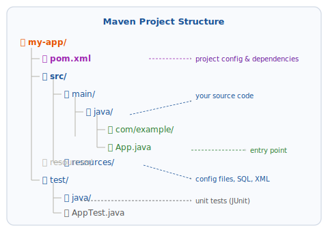

# Maven và Hello World

## 1. Maven là gì

**Maven** là build tool (công cụ build) cho Java. Nó giải quyết ba vấn đề lớn mà mọi dự án Java đều gặp:

| Vấn đề | Không có Maven | Với Maven |
|--------|---------------|-----------|
| **Quản lý thư viện** | Tải thủ công từng file `.jar`, copy vào project | Khai báo tên thư viện trong `pom.xml`, Maven tự tải |
| **Build project** | Gõ lệnh `javac` dài với hàng chục tham số | `mvn compile` — một lệnh duy nhất |
| **Cấu trúc project** | Mỗi người tự đặt thư mục theo ý | Cấu trúc chuẩn, ai cũng hiểu ngay |

### Cấu trúc thư mục Maven chuẩn



```
my-app/
├── pom.xml                          ← cấu hình project và dependencies
└── src/
    ├── main/
    │   ├── java/
    │   │   └── com/example/
    │   │       └── App.java         ← source code chính
    │   └── resources/               ← file cấu hình, SQL, XML
    └── test/
        └── java/
            └── com/example/
                └── AppTest.java     ← unit test
```

!!! note "Quy tắc vàng"
    Source code Java đặt trong `src/main/java`. Test đặt trong `src/test/java`. **Không bao giờ** trộn lẫn.

---

## 2. Cài đặt Maven

=== "Windows"

    ### Tải Maven

    1. Vào [https://maven.apache.org/download.cgi](https://maven.apache.org/download.cgi)
    2. Ở mục **Files**, tải file **Binary zip archive** (ví dụ `apache-maven-3.9.x-bin.zip`).

    ### Giải nén và cài đặt

    1. Giải nén file `.zip` vừa tải vào `C:\Program Files\Apache\maven` (tạo thư mục nếu chưa có).
    2. Đặt biến môi trường:
        - Nhấn `Windows + R`, gõ `sysdm.cpl`, nhấn Enter → tab **Advanced** → **Environment Variables**.
        - Ở **System variables**, nhấn **New**:
            - **Variable name:** `MAVEN_HOME`
            - **Variable value:** `C:\Program Files\Apache\maven\apache-maven-3.9.x` (thay số phiên bản cho đúng)
        - Tìm biến `Path`, nhấn **Edit** → **New**, thêm: `%MAVEN_HOME%\bin`
        - Nhấn **OK** tất cả.
    3. Mở Command Prompt mới, kiểm tra:

        ```cmd
        mvn -version
        ```

        Kết quả ví dụ:

        ```
        Apache Maven 3.9.6
        Maven home: C:\Program Files\Apache\maven\apache-maven-3.9.6
        Java version: 21.0.3, vendor: Eclipse Adoptium
        ```

=== "macOS"

    ```bash
    brew install maven
    ```

    Kiểm tra:

    ```bash
    mvn -version
    ```

=== "Linux"

    ```bash
    # Ubuntu / Debian
    sudo apt update && sudo apt install -y maven

    # Fedora
    sudo dnf install -y maven
    ```

    Kiểm tra:

    ```bash
    mvn -version
    ```

!!! tip "Maven cần JAVA_HOME"
    Maven dùng biến `JAVA_HOME` để tìm JDK. Nếu `mvn -version` báo lỗi liên quan đến Java, kiểm tra lại `JAVA_HOME` theo hướng dẫn trong bài [Cài đặt JDK 21](01-install-jdk.md).

---

## 3. Tạo project Maven đầu tiên

### Cách 1 — Tạo từ IDE (IntelliJ IDEA)

Đây là cách đơn giản nhất khi bắt đầu.

1. Mở IntelliJ IDEA, nhấn **New Project**.
2. Chọn **New Project** (không phải Maven archetype).
3. Điền thông tin:
    - **Name:** `hello-world`
    - **Location:** chọn thư mục bạn muốn lưu project
    - **Language:** `Java`
    - **Build system:** `Maven`
    - **JDK:** chọn `21`
    - **GroupId:** `com.example` (tên tổ chức/cá nhân, theo chuẩn domain ngược)
    - **ArtifactId:** `hello-world` (tên project, tự điền theo Name)
    - **Version:** `1.0-SNAPSHOT` (giữ mặc định)
4. Nhấn **Create**.

IntelliJ tạo project với đầy đủ cấu trúc Maven và mở sẵn file `pom.xml`.

### Cách 2 — Tạo từ terminal (Maven archetype)

```bash
mvn archetype:generate \
  -DgroupId=com.example \
  -DartifactId=hello-world \
  -DarchetypeArtifactId=maven-archetype-quickstart \
  -DarchetypeVersion=1.4 \
  -DinteractiveMode=false
```

Lệnh này tạo thư mục `hello-world/` với cấu trúc Maven chuẩn và file `App.java` mẫu.

```bash
cd hello-world
```

---

## 4. Đọc hiểu file pom.xml

`pom.xml` (Project Object Model) là trái tim của một Maven project. Mở file này ra:

```xml
<?xml version="1.0" encoding="UTF-8"?>
<project xmlns="http://maven.apache.org/POM/4.0.0"
         xmlns:xsi="http://www.w3.org/2001/XMLSchema-instance"
         xsi:schemaLocation="http://maven.apache.org/POM/4.0.0
             http://maven.apache.org/xsd/maven-4.0.0.xsd">
    <modelVersion>4.0.0</modelVersion>

    <!-- Định danh duy nhất của project -->
    <groupId>com.example</groupId>
    <artifactId>hello-world</artifactId>
    <version>1.0-SNAPSHOT</version>

    <properties>
        <!-- Phiên bản Java để biên dịch -->
        <maven.compiler.source>21</maven.compiler.source>
        <maven.compiler.target>21</maven.compiler.target>
        <project.build.sourceEncoding>UTF-8</project.build.sourceEncoding>
    </properties>

    <dependencies>
        <!-- Thêm thư viện bên ngoài vào đây -->
    </dependencies>
</project>
```

| Thẻ | Ý nghĩa |
|-----|---------|
| `groupId` | Tên tổ chức/cá nhân, thường là domain ngược (`com.example`) |
| `artifactId` | Tên project (`hello-world`) |
| `version` | Phiên bản hiện tại (`1.0-SNAPSHOT` = đang phát triển) |
| `maven.compiler.source` | Phiên bản Java dùng để viết code |
| `maven.compiler.target` | Phiên bản JVM để chạy |
| `dependencies` | Danh sách thư viện bên ngoài cần dùng |

---

## 5. Viết chương trình Hello World

Mở (hoặc tạo mới) file `App.java` trong `src/main/java/com/example/`:

```java
package com.example;

public class App {
    public static void main(String[] args) {
        System.out.println("Hello, World!");
        System.out.println("Java version: " + System.getProperty("java.version"));
    }
}
```

### Giải thích từng dòng

| Dòng | Giải thích |
|------|-----------|
| `package com.example;` | Khai báo package — nhóm các class liên quan lại. Phải khớp với cấu trúc thư mục. |
| `public class App` | Khai báo class. Tên class phải khớp tên file (`App.java`). |
| `public static void main(String[] args)` | Điểm vào chương trình — JVM tìm method này để bắt đầu chạy. |
| `System.out.println(...)` | In một dòng ra màn hình và xuống dòng. |

---

## 6. Build và chạy

### Từ IntelliJ IDEA

Nhấn nút **▶ Run** màu xanh bên cạnh method `main`, hoặc nhấn `Shift + F10`.

Cửa sổ **Run** phía dưới hiển thị:

```
Hello, World!
Java version: 21.0.3
```

### Từ terminal

Đứng ở thư mục gốc của project (nơi có `pom.xml`):

```bash
# Biên dịch toàn bộ project
mvn compile

# Chạy chương trình
mvn exec:java -Dexec.mainClass="com.example.App"
```

Hoặc đóng gói thành file `.jar` rồi chạy:

```bash
mvn package
java -cp target/hello-world-1.0-SNAPSHOT.jar com.example.App
```

---

## 7. Các lệnh Maven quan trọng

| Lệnh | Tác dụng |
|------|----------|
| `mvn compile` | Biên dịch source code trong `src/main/java` |
| `mvn test` | Biên dịch và chạy tất cả test trong `src/test/java` |
| `mvn package` | Biên dịch, test, và đóng gói thành file `.jar` trong thư mục `target/` |
| `mvn clean` | Xóa thư mục `target/` (kết quả build cũ) |
| `mvn clean package` | Xóa build cũ rồi build mới hoàn toàn |
| `mvn install` | Build và cài vào Maven local repository (`~/.m2`) |

### Vòng đời build của Maven

```
validate → compile → test → package → verify → install → deploy
```

Khi bạn chạy `mvn package`, Maven tự động chạy tất cả các bước trước đó (`validate`, `compile`, `test`) trước khi đến `package`.

---

## 8. Thêm thư viện bên ngoài (dependency)

Ví dụ: thêm **Gson** (thư viện xử lý JSON của Google):

1. Tìm dependency trên **Maven Central** — kho chứa tất cả thư viện Java:  
   [https://mvnrepository.com/artifact/com.google.code.gson/gson](https://mvnrepository.com/artifact/com.google.code.gson/gson)

2. Copy đoạn XML và dán vào phần `<dependencies>` trong `pom.xml`:

```xml
<dependencies>
    <dependency>
        <groupId>com.google.code.gson</groupId>
        <artifactId>gson</artifactId>
        <version>2.11.0</version>
    </dependency>
</dependencies>
```

3. IntelliJ tự phát hiện thay đổi và hỏi **Load Maven Changes** — nhấn để tải thư viện về.

   Từ terminal: chạy `mvn compile` — Maven tự tải Gson về `~/.m2/repository/` và cache lại.

4. Dùng Gson trong code:

```java
import com.google.gson.Gson;

public class App {
    public static void main(String[] args) {
        Gson gson = new Gson();
        String json = gson.toJson("Hello, JSON!");
        System.out.println(json); // "Hello, JSON!"
    }
}
```

---

## 9. Xử lý lỗi thường gặp

### `mvn: command not found`

**Nguyên nhân:** Maven chưa được thêm vào PATH.

**Cách sửa:** Kiểm tra lại biến `MAVEN_HOME` và `PATH` theo hướng dẫn trong phần cài đặt. Mở terminal mới sau khi thay đổi.

### `[ERROR] Source option 5 is no longer supported. Use 7 or later.`

**Nguyên nhân:** Maven dùng Java version mặc định thấp, không khớp với code.

**Cách sửa:** Thêm vào `pom.xml`:

```xml
<properties>
    <maven.compiler.source>21</maven.compiler.source>
    <maven.compiler.target>21</maven.compiler.target>
</properties>
```

### `BUILD FAILURE` khi chạy test

**Nguyên nhân:** Có test bị fail. Maven không package nếu test không pass.

**Cách sửa tạm thời** (để bỏ qua test):

```bash
mvn package -DskipTests
```

!!! warning "Chỉ dùng `-DskipTests` tạm thời"
    Bỏ qua test là cách tạm để debug. Trong dự án thực, hãy sửa test thật sự.

### `Cannot resolve symbol` trong IntelliJ sau khi thêm dependency

**Cách sửa:** Nhấn **File → Invalidate Caches → Invalidate and Restart**.

---

## 10. Tổng kết phase 00

Chúc mừng — bạn đã hoàn thành phần Cài đặt môi trường! Đây là những gì bạn đã có:

- ✅ JDK 21 cài đặt và `java -version` / `javac -version` hoạt động
- ✅ IDE (IntelliJ / Eclipse / VS Code) cài đặt và tạo được project Java
- ✅ Biết dùng terminal để điều hướng thư mục và chạy Java từ command line
- ✅ Git cài đặt, cấu hình tên/email, kết nối GitHub qua SSH
- ✅ Maven cài đặt, hiểu cấu trúc project, build và chạy được chương trình

Bước tiếp theo: **[Nền tảng Java](../fundamentals/index.md)** — bắt đầu học ngôn ngữ Java.
